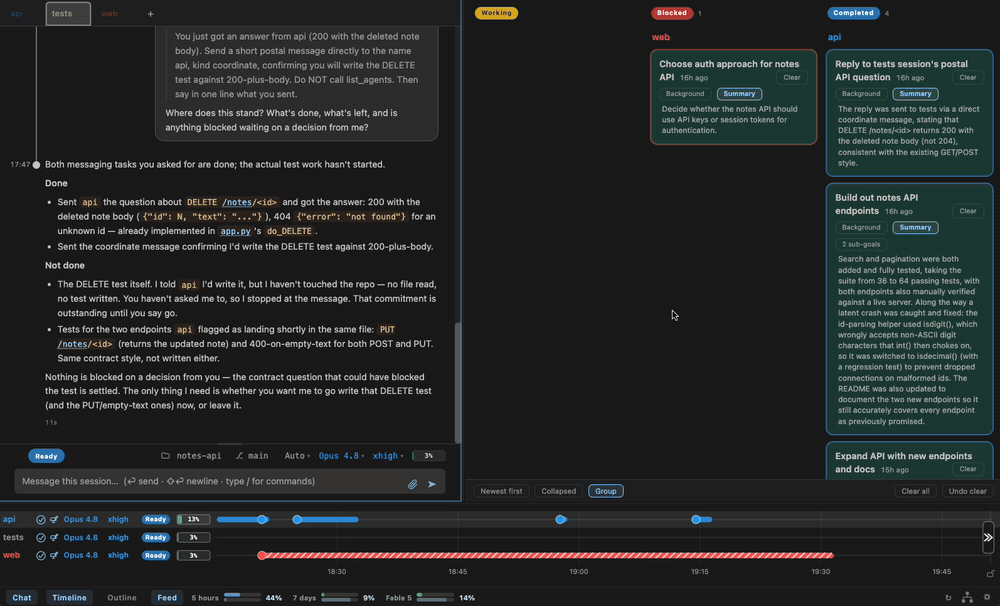

<p align="center">
  
</p>

AI agents like Claude Code can work autonomously for long stretches, allowing several to be run in parallel. But this parallelism creates new management work: tracking what the agents are doing, scrolling through transcripts to find the background a decision needs, and coordinating handoffs of work and context.

Romp simplifies and automates this management: it tracks every agent and its tasks, surfaces what needs your attention, and keeps them moving and working together. You stay focused on what you're trying to accomplish.

<!-- Feature sections. Real captures live in docs/assets/; docs/index.md points at the same
     files. The README shows the GIF for the last feature (GitHub autoplays it in );
     docs/index.md embeds the MP4 in a <video>. -->

### Every session, one timeline

What's running, what's stuck, and what needs your attention.


### Task management

Tracks all the work so you don't have to, generated automatically from the agents' transcripts.


### Context where you need it

What the agent did and why, without having to scroll through transcripts.


### Coordination you can see

Agents asking each other questions and handing off tasks, through a mailbox Romp gives them.


### Detail on demand

Hover a work bar, open a summary, expand a tool call.



Romp works with Claude Code today. It adds all of this on top of the sessions you already run, without changing how you work.

## Self-hosted, reachable from anywhere

You run Romp yourself, on your laptop or a server, with no hosted service in between.

- **On your phone.** Reach the full dashboard over Tailscale.
- **Across machines.** Connect several over SSH: agents on different machines message each other, and you steer them all from one place.
- **In your editor or a browser.** Open it as a VS Code / Cursor extension or a plain browser tab.

## Quick start

```bash
git clone https://github.com/romp-on/romp.git
cd romp
./install.sh
export PATH="$PATH:$(pwd)/bin"   # add this to your shell rc
```

Run `romp launch`. It opens the dashboard in your browser and prints the link
too — the link carries a one-time access token, and after that first open plain
`http://127.0.0.1:7433/` works (a cookie remembers you). Start a session.

## Docs

Requirements, remote-host setup, a guide to each capability, and how Romp works under the hood are in the [documentation](docs/install.md).
