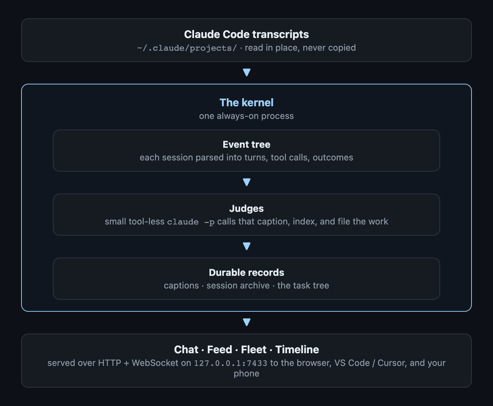

# How Romp works

Romp is one always-on **kernel**: a single Python process that reads each
session's Claude Code transcript, builds an event tree, runs the **judges**
that write the durable records, and serves the four views over HTTP +
WebSocket.

{ width="75%" }

The judges are small `claude -p` calls with no tools and MCP disabled: they
can caption, index, and file work, but structurally cannot act. They spend a
little of your own Claude quota; that is the cost of the live captions and
the task tree. Their records, timeline events, and mail all live under
`${XDG_STATE_HOME:-~/.local/state}/romp/`; transcripts are read where Claude
Code already writes them and never copied.

## For contributors

The Internals section holds the deep dives, closest to the code:

- [Judges](judges.md): the full roster, who each judge is and when it runs.
- [The judge pipeline](judge-pipeline.md): the diagram map of the flow above.
- [How a card gets its state](goal-state.md): the state model, chip by chip.
- [The event model](event-model.md): the bottom-layer event tree.
- [The read side](read-side.md): the kernel and the panes.
- [The SDK session backend](sdk-backend.md): how the default backend drives
  the Agent SDK.
