# How Romp works

!!! note "Optional reading"
    You don't need any of this to use Romp. The Internals section is here for
    when you're curious how it works under the hood.
    Describes the system as of **2026-07-23**; the behaviour it documents moves,
    so treat anything here as a snapshot rather than a contract.

Romp is one always-on **kernel**: a single Python process that reads each
session's Claude Code transcript, builds an event tree, runs the **judges**
that write the durable records, and serves the four views over HTTP +
WebSocket.

{ width="75%" }

The judges are small `claude -p` calls with no tools and MCP disabled: they can
caption, index, and file work, but structurally cannot act. They spend a little
of your own Claude quota; that is the cost of the live captions and the task
tree. Their records, timeline events, and mail all live under
`${XDG_STATE_HOME:-~/.local/state}/romp/`; transcripts are read where Claude
Code already writes them and never copied.

## The judges, end to end

Transcripts and peer mail become segments; judges turn segments into events on
per-node logs; a deterministic rollup folds those logs into the board. The LLM
judges sit between two deterministic layers, so every judgment is recorded and
replayable. In the diagram, blue is an LLM board judge (writes goal state),
green an LLM caption judge (writes only text), gray deterministic code, yellow
data at rest, and pink you.

{ width="100%" }

## What the installer sets up

`install.sh` registers the Claude Code hooks, the postal MCP config, and the
`romp` skills; builds the editor extension; and installs a login service that
keeps the kernel up. It is idempotent: re-running adds only what is missing, and
it never touches hooks you registered yourself.

It installs nothing into your Python. The kernel and CLI are standard library
only; the one dependency of the [SDK backend](guide.md#session-backends)
(`claude-agent-sdk`) lives in a dedicated venv under `~/.local/state/romp/`,
built against the newest Python 3.10+ on the machine and rebuilt automatically
when that Python changes.

## The rest of this section

The rest of this section drills into each piece:

- [Judges](judges.md): the full roster, who each judge is and when it runs.
- [The judge pipeline](judge-pipeline.md): every trigger tier by tier, and the
  card state machine.
- [How a card gets its state](goal-state.md): the state model, chip by chip.
- [The event model](event-model.md): the bottom-layer event tree.
- [The read side](read-side.md): the kernel and the panes.
