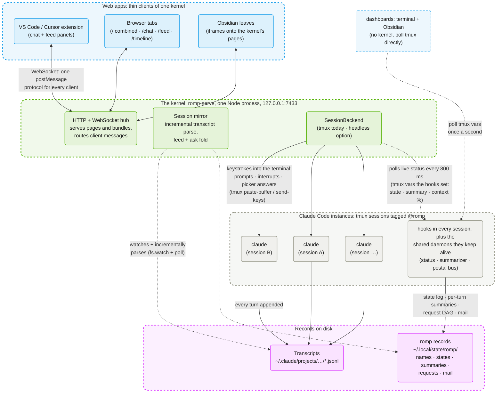
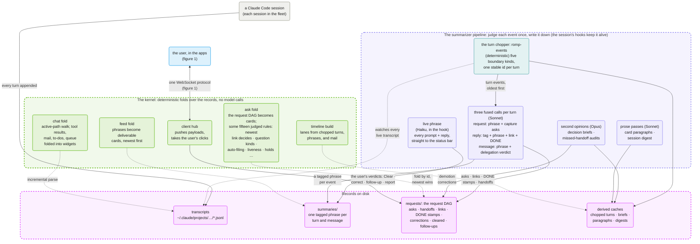

# romp architecture figures

Romp turns a fleet of terminal Claude Code sessions into one coordinated,
observable system. This series of figures explains how. Figure 1 gives the
overall shape. Figure 2 follows a turn through the event pipeline: the model
calls that judge it and the rules that fold it into cards. Later figures zoom
into the subsystems: the postal service, the request DAG, the timeline, and
the two session backends.

Every figure uses the same conventions, with colors from romp's identity
palette:

- **blue**: apps the user looks at
- **green**: the kernel, romp's single server process
- **gray**: Claude Code instances and the hooks inside them
- **pink**: records on disk
- **purple**: pipeline stages that call a model
- **teal**: deterministic pipeline stages
- **solid arrows**: writes and commands
- **dotted arrows**: reads only

## Figure 1: Claude Code instances, the kernel, and web apps

Everything meets at the kernel. The web apps above it speak one shared
WebSocket protocol; between the kernel and the sessions below there is no
API at all, only typed keystrokes going down and files read back up.

Every interactive UI is a thin client of one kernel. The VS Code extension
hosts the chat and feed bundles in webview panels; Obsidian shows the
kernel's pages as iframes; both spawn the kernel when none is running, then
behave exactly like browser tabs. Only the dashboards, the terminal
`romp dashboard` and its Obsidian twin, bypass the kernel: they poll the
tmux variables directly.

The kernel touches sessions only as a user would. To drive one, it types:
prompts, interrupts, and picker answers all go into the session's terminal
through tmux. To observe one, it reads: the transcript JSONL that Claude
Code appends every turn, the records that romp's hooks and daemons maintain
under `~/.local/state/romp/`, and the live status the hooks publish as tmux
variables. Nothing requires a romp-specific runtime: any `claude` in a tmux
pane with the hooks installed participates, and sessions keep working and
keep being recorded while the kernel is down.

The headless backend swaps the tmux pane for a `claude -p` child process per
turn: same kernel, same clients, no terminal. A later figure compares the
two backends.

## Figure 2: the event pipeline, from turn to card

Romp's business logic splits in two. Models judge each event once, on its way
to disk; the kernel re-derives everything the user sees from the accumulated
records, on every change, with deterministic rules. The records between them
are the only interface, and corrections close the loop: the user's verdicts
land in the same files, and the fold gives them the last word.

The pipeline starts deterministic. The turn chopper parses each transcript
into turn events at the moments work began: a typed prompt, a dequeued
prompt, a message absorbed mid-turn, a drained message, or a mid-turn
decision. Each event carries a stable id, so every judgment downstream binds
by id instead of by time window. The summarizer daemon then judges each event
with three fused model calls: the request call phrases a typed prompt and
captures the asks it contains, the reply call tags what a turn needs from the
user with one of six relevance tags and links the work to the open asks it
served, and the message call phrases peer mail and decides whether it
delegates work. Sonnet handles this volume, a few hundred calls a day. Two
low-volume jobs run on Opus: writing a brief of what the user must decide
when a DECISION lands, and auditing a dismissed message when the recipient
soon produces work linked to nothing. A Haiku call in the hook puts a phrase
on the status bar within seconds of every prompt and reply. Every call runs
headless with zero tools, so the model can only emit a line.

The records are the contract between the two halves. The pipeline appends;
the kernel reads; nothing edits a judgment in place. `summaries/` holds one
tagged phrase per turn and message. `requests/` holds the request DAG: the
user's asks as roots, agent-to-agent handoffs as internal nodes, reply links
with DONE stamps, and the user's own verdicts appended through the feed UI.
A correction is one more record, and at fold time the newest wins, so the
user's verdict overrides the model's.

The kernel folds these files into every surface on every change and never
calls a model. The chat fold walks a transcript's active conversation path
and folds tool results, peer mail, the to-do list, and queued prompts into
widgets. The feed fold turns summaries into deliverable cards. The timeline
build assembles per-session lanes from the chopped turns, the phrases, and
the mail log. The ask fold turns the request DAG into cards in three columns
and carries most of the rules: some fifteen of them, each encoding a ruling
from daily use. The newest non-routine link decides a node's status. A
DECISION clears when the user's next typed turn arrives; an ACTION clears
only on an explicit done. A settled card files itself into Completed and
pulls itself back when work touches it; a session mid-turn on a
not-yet-attributed prompt holds its cards in place. When a card needs prose
the kernel does not write it; it spawns the pipeline's paragraph generator
and waits for the file.
