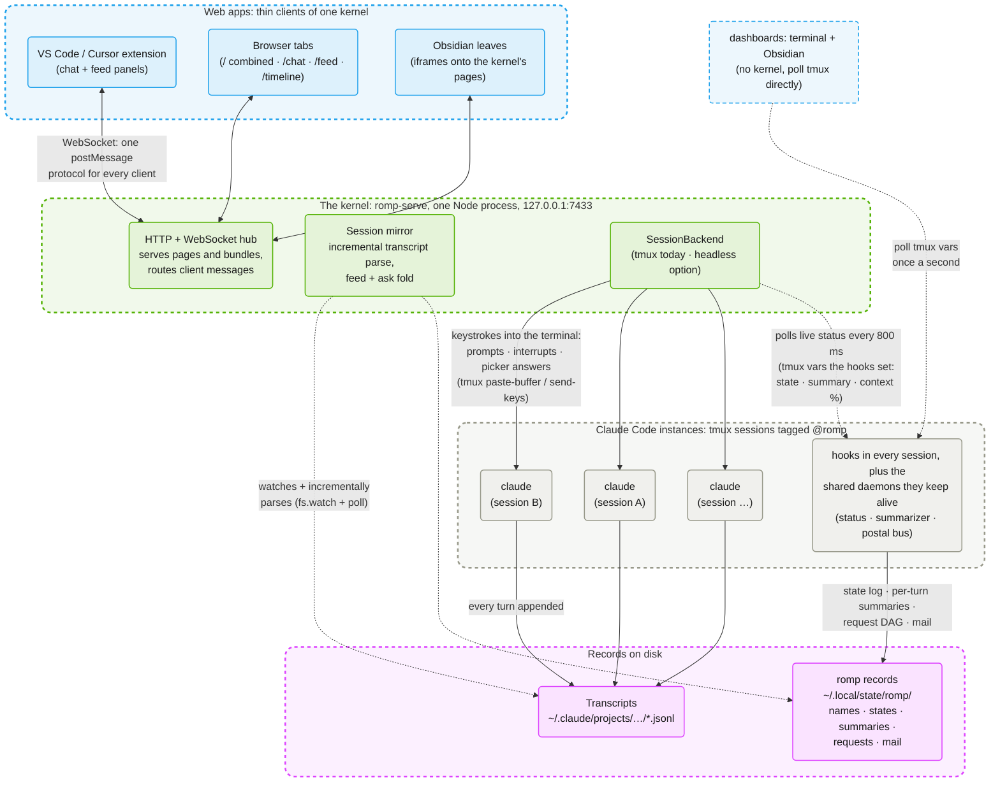
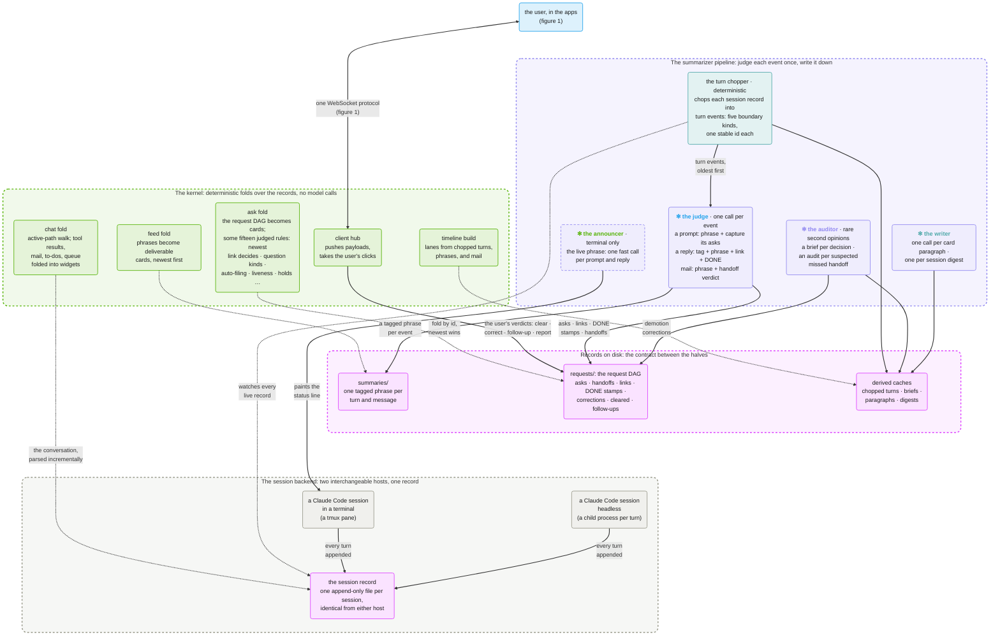
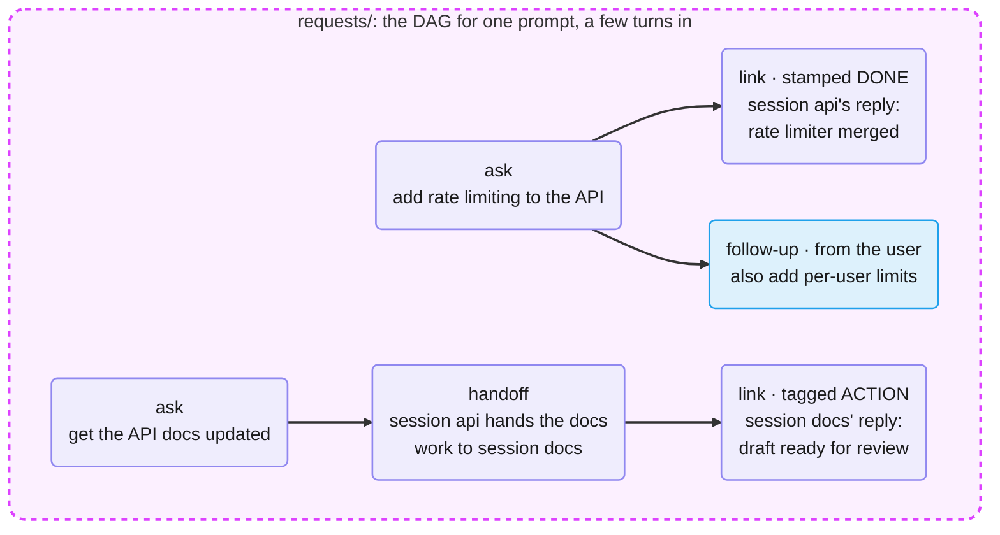

# romp architecture figures

Romp turns a fleet of Claude Code sessions into one coordinated,
observable system. This series of figures explains how. Figure 1 gives the
overall shape. Figure 2 follows a turn through the event pipeline: the model
roles that judge it and the rules that fold it into cards. Later figures zoom
into the subsystems: the postal service, the request DAG, the timeline, and
the two session backends.

Every figure uses the same conventions, with colors from romp's identity
palette:

- **blue**: apps the user looks at
- **green**: the kernel, romp's single server process
- **gray**: Claude Code instances and the hooks inside them
- **pink**: records on disk
- **purple**: pipeline stages that call a model
- **teal**: deterministic pipeline stages
- **✻**: a model role; unmarked stages are deterministic code
- **model roles**: bold and colored in romp's default palette order, **the judge** · **the announcer** · **the auditor** · **the writer**
- **dashed node borders**: modules that exist only with the terminal host; everything else runs with either backend
- **solid arrows**: writes and commands
- **dotted arrows**: reads only

## Figure 1: Claude Code instances, the kernel, and web apps

Everything meets at the kernel. The web apps above it speak one shared
WebSocket protocol; between the kernel and the sessions below there is no
API at all, only typed keystrokes going down and files read back up.

Every interactive UI is a thin client of one kernel. The VS Code extension
hosts the chat and feed bundles in webview panels; Obsidian shows the
kernel's pages as iframes; both spawn the kernel when none is running, then
behave exactly like browser tabs. Only the dashboards, the terminal
`romp dashboard` and its Obsidian twin, bypass the kernel: they poll the
tmux variables directly.

The kernel touches sessions only as a user would. To drive one, it types:
prompts, interrupts, and picker answers all go into the session's terminal
through tmux. To observe one, it reads: the transcript JSONL that Claude
Code appends every turn, the records that romp's hooks and daemons maintain
under `~/.local/state/romp/`, and the live status the hooks publish as tmux
variables. Nothing requires a romp-specific runtime: any `claude` in a tmux
pane with the hooks installed participates, and sessions keep working and
keep being recorded while the kernel is down.

The headless backend swaps the tmux pane for a `claude -p` child process per
turn: same kernel, same clients, no terminal. A later figure compares the
two backends.

## Figure 2: the event pipeline, from turn to card

Romp's business logic splits in two: a pipeline of model judgments writes
each event down once, on its way to disk, and the kernel re-derives
everything the user sees by re-folding the accumulated records on every
change, with deterministic rules. Most of what it derives are cards, the
tiles of the feed, each holding one thing for the user: a decision to make,
work to review, an ask in flight. The records between the two halves are
the only interface, and corrections close the loop: the user's verdicts
land in the same files and override the pipeline's judgments at fold time.

Either host yields the same session record. A session runs in a terminal,
as a tmux pane the kernel types into, or headless, as a child process
spawned per turn; both append one file per session in the same format. The
chopper, the model roles, and the kernel's folds see only the record, so
they run unchanged on either host. The one exception carries a dashed
border: **the announcer** paints the
terminal's status line, a surface the headless host does not have.

The turn chopper, the pipeline's deterministic first stage, parses each
session record into turn events at the moments work began: a typed prompt,
a dequeued prompt, a message absorbed mid-turn, a drained message, or a
mid-turn decision. Each event carries a stable id, so every judgment
downstream binds by id instead of by time window.

Four model roles do the judging, each marked ✻ in the figure. A role is
one logical model: it has its own job, its own prompt, and a model tier
sized to the job. None runs as a resident process; every invocation is a
fresh single-shot call that sees one event, runs headless with zero tools,
and can only emit a line.

- **The judge** rules on every event once. A typed prompt is phrased and
  mined for its asks, the requests it makes of the session. A finished
  reply gets one of six relevance tags for what the turn needs from the
  user (DECISION, ACTION, IDEA, WAIT, DONE, or DETAILS, in falling
  precedence), plus links to the open asks it served and a DONE stamp on
  each ask it completed. Peer mail gets a verdict on whether it hands work
  off to the receiving session, a handoff.
- **The announcer** phrases every prompt and reply into the live phrase,
  the one-line summary on the session's status line, within seconds; the
  latency budget is why it runs on a small fast model.
- **The auditor**, the strongest model, gives second opinions where the
  stakes are high: a brief of what the user must decide when
  **the judge** tags a DECISION, and an
  audit for a missed handoff when a dismissed message is followed by work
  linked to nothing.
- **The writer** produces the longer prose: the paragraph a card expands
  into, and the session digest, a rolling summary of the session's purpose
  and recent work.

The sessions keep the pipeline alive through their hooks, so events keep
being judged while the kernel is down.

The records are the contract between the two halves. The pipeline appends
and the kernel reads; nothing edits a judgment in place. `summaries/` holds
one tagged phrase per turn and message. `requests/` holds the request DAG:
the user's asks as roots, handoffs as internal nodes, reply links with
their DONE stamps, and the user's own verdicts appended through the feed
UI. A correction is one more record; at fold time the newest wins.

A small example shows how the fold reads these records.
**The judge** wrote the purple records;
the user wrote the blue one. Both asks came from a single typed prompt;
the handoff is the peer message that delegated the docs work.

At fold time the newest record on each path decides. The first ask
reopens, because the user's follow-up is newer than its DONE link. The
second ask waits on the user, because its newest link is an ACTION: the
draft needs review.

The kernel folds these files into every surface on every change and never
calls a model. The chat fold walks a session record's active conversation
path and folds tool results, peer mail, the to-do list, and queued prompts
into widgets. The feed fold turns summaries into cards, newest first. The
timeline build assembles per-session lanes from the chopped turns, the
phrases, and the mail log. The ask fold turns the request DAG into cards
in three columns.

Most of the rules live in the ask fold: some fifteen, each encoding a
ruling from daily use. The newest link above DETAILS decides a node's
status.
A DECISION clears when the user's next typed turn arrives; an ACTION clears
only on an explicit done. A settled card files itself into Completed and
pulls itself back when work touches it; a session mid-turn on a
not-yet-attributed prompt holds its cards in place. When a card needs
prose the kernel does not write it; it spawns
**the writer** and waits for the file.

## Following one prompt through the pipeline

The pipeline reads most clearly when you follow one prompt from keystroke to
card. Take a prompt typed into a session named `api`: "add rate limiting to
the API, and get the docs updated." The sections below carry that prompt
through each stage and then note where other inputs take a different path.
The request DAG it builds is the one drawn above.

### The turn chopper

The turn chopper converts the raw session record into the events everything
downstream judges. When the prompt lands, the session appends it to the
record, and the chopper marks one event: a typed boundary at the instant the
turn began, carrying a stable id built from the session, the timestamp, and a
hash of the text. The work that follows, up to the next boundary, is that
event's work period.

A typed prompt is one of five boundary kinds, and the other four cover the
ways work starts without you typing at that moment. A prompt typed while the
session is busy waits in the queue and becomes a queued boundary when the
session picks it up. A message that arrives mid-turn and folds into the
running work becomes an absorbed boundary; one delivered as the turn ends
becomes a drain. Answering a picker or approving a plan mid-turn steers the
session like a fresh prompt, so it becomes a decision boundary. Each kind
gets its own event and its own id, and that id is the join key: every later
judgment binds to the event by id, never by matching clocks.

### The model roles

The typed event goes first to
**the judge**, which reads the prompt and
records what it asks for. Here it finds two requests the prompt makes of the
session, rate limiting and a docs update, and writes them to `requests/` as
two asks, the roots of the graph. While that runs,
**the announcer** puts a live phrase on the
session's status line within seconds, so you see "adding rate limiting"
without opening anything.

The judge runs again each time the work produces something. When session
`api` finishes the limiter and replies, the judge's reply call tags the turn,
links the reply to the rate-limiting ask, and stamps that ask DONE. When
`api` hands the docs work to a session named `docs` by sending it a message,
the judge's message call rules the message a handoff and records it as a node
under the docs ask.

The reply tag is the judge's main lever, and its six values set what a card
asks of you. DECISION and ACTION both need you, a decision to make or work to
review; DONE closes an ask; WAIT marks a turn paused on an external event
rather than on you; IDEA records a suggestion; DETAILS is routine and never
decides a card's status. The tags fall in that precedence, so the most
demanding one a turn earns is the one that shows.

Two roles enter only when the stakes rise.
**The auditor**, the strongest model,
writes a brief of what you must decide when a reply is tagged DECISION, and
audits a handoff that looks dropped when a session is sent a message,
dismisses it, and then produces work linked to nothing.
**The writer** produces the longer prose on
demand: the paragraph a card expands into, and the rolling digest of what a
session is for.

### The request DAG

After a few turns the example's records form the DAG drawn above, and three
node kinds make it up. The two asks are the roots, the requests you typed.
The handoff is an internal node, the docs ask delegated from `api` to `docs`.
The links are the leaves, each a reply bound to the ask it served, carrying
its tag and, where the work finished, a DONE stamp.

Your own verdicts append to the same graph as more records. A follow-up, a
correction, or a clear is one record on a path, and at fold time the newest
record on a path wins. Typing "also add per-user limits" lands as a follow-up
under the rate-limiting ask, newer than the DONE stamp beneath it.

### The feed fold and the ask fold

The feed fold and the ask fold are the two read-time passes that turn these
records into cards. The feed fold is the simpler one: it orders the tagged
phrases newest first and renders each as a card. The ask fold is where the
rules live: it folds the request DAG into three columns, Working, Blocked,
and Completed.

The example's two asks land in different columns, and a later record moves
one of them. The rate-limiting ask, its newest link a DONE, files into
Completed; the docs ask, its newest link an ACTION, sits in Blocked awaiting
your review. When the follow-up arrives it reopens the rate-limiting ask,
now newer than the DONE, and pulls the card back to Working.

The fold carries some fifteen such rules, each one kept from daily use. A
liveness check asks whether anything is still moving on an ask: whether the
owning session is working it, a handoff holds it, or nothing will move
without you. An ask that nothing will move files itself out of Working on its
own, unless it is paused on an external event like a build or a peer's reply,
in which case it stays put because it is not waiting on you.
