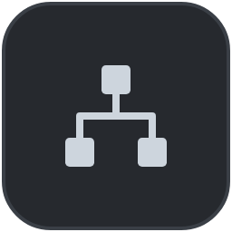

# Guide

This guide covers how to use Romp, and how its back end works.

## The Romp dashboard (the front end)

Romp gathers all your Claude Code sessions into a single dashboard, with four
complementary views of what the agents are doing:

- **[The chat](#the-chat)** is the regular interface for talking to a coding
  agent, with features that make a long session easier to scan.
- **[The feed](#the-feed)** is Romp's task-management layer: what is in
  progress, what needs your input, and what is done.
- **[The timeline](#the-timeline)** is the history of what each session worked
  on and how they coordinated; click any part to jump to that moment in the
  chat.
- **[The outline](#the-outline)** lists every session with its tasks, for
  reviewing what a session has done and searching across all of them.

### The chat

{ width="100%" }

### The feed

The feed is Romp's task-management layer: a card for each task. Romp's
[judges](judges.md) watch each session's work, split it into those tasks, and
keep every card current.

Cards sit in three columns:

- <span class="romp-chip romp-chip-working">Working</span> — the session is
  actively working on the task.
- <span class="romp-chip romp-chip-blocked">Blocked</span> — it needs your
  input to move on.
- <span class="romp-chip romp-chip-completed">Completed</span> — done, ready
  for you to review and clear.

{ width="100%" }

**Background** is why the agent is taking the action, and **Summary** is what it
did. When a task divides naturally into parts, the card's **Sub-goals** button
opens them.

Cards follow the work rather than the session: one session can hold several
tasks, and a task can be handed from one session to another.

**Clear** a card when you are done with it. A cleared card is archived, and no
more work is added to it.

### The timeline

Each row is one session. A bar is a stretch where the session was working, and a
circle is a message you sent. A striped stretch means the session is blocked,
waiting on your input.

{ width="100%" }

Click a bar or a message marker to jump straight to where it happened in the
chat.

Session statuses:

{ width="70%" }

### The outline

Every session with its task tree: open work stays up top, finished work folds
beneath. Open the outline to review what a session has worked through, or to
find past work: the search box reaches every session, live or closed.

{ width="100%" }

## Automatic nudges

Agents stall: they hit an API error, they get interrupted, or they end a turn
leaving it ambiguous whether a task is done. Romp nudges a stalled session with
an injected message, so every task ends up either explicitly done or explicitly
needing your input.

Romp asks the agent, item by item, where each open piece stands: continue what
it can, and say what blocks the rest.

- If the agent can keep going, it does, and you were never interrupted.
- If something needs you, the card flips to <span class="romp-chip romp-chip-blocked">Blocked</span> and names exactly what
  it needs.

Nudging engages only when you are not actively messaging the session, so it
never talks over you and never loops on its own messages.

A session can also be waiting on something unrelated to you: it dispatches work
into the background, then pauses for the result. In that case it shows an
<span class="romp-chip romp-chip-await">Awaiting</span> chip. The chip clears on the
session's next turn, when the task finishes or blocks, when you clear the card,
or as soon as you reply.

## Inter-agent communication (the Romp Postal Service)

Sessions message each other through a mailbox Romp gives them, and every
exchange is visible to you. Each session gets mail tools: send a message to a
session by name, check the inbox, and see who is live. Each session also
publishes a working note saying what it currently holds, so agents can see who
to talk to instead of messaging each other to find out.

The timeline draws an arc for each message. Hover one for its gist:

<video src="../assets/guide/coordination.mp4" controls loop muted playsinline preload="none" data-romp-autoplay width="100%"></video>

Underneath, a local message bus writes the message into a mailbox on disk that
belongs to the recipient, then either types it straight into that session if it
is sitting idle, or leaves it to be collected when the session's current turn
ends. The recipient reads it in its chat, on a card naming the sender and the
kind:

{ width="100%" }

Every message declares its kind:

- **delegate** — the recipient owns the work now.
- **coordinate** — a heads-up; a reply is optional.
- **question** — an answer is required.

The same mailbox is on the command line, for you and for scripts:

```bash
romp --mail send --kind question api "Which auth approach did we settle on?"   # send, to the session named "api"
romp --mail inbox                                                              # read this session's messages, and clear them
```

The full mail surface, shell and in-session, is in the
[Reference](reference.md#mail-from-the-shell). Names resolve against the
currently live sessions; sending to a dead session's name errors instead of
silently parking mail.

## Sessions, revival, and search

A Romp session is a name, not a conversation. The name survives `/clear`,
relaunches, and kernel restarts, so `api` is the same `api` whenever you come
back to it.

Closed sessions come back. Type a closed session's name into the picker and Romp
offers to revive it, with its history intact.

Search reaches inside sessions, not just across their names. As sessions run, a
lightweight index judge writes each one a headline and an abstract of what it
did, so searching for the work finds the session that did it, months later.

### Session backends

Sessions run on one of two backends, chosen per session:

- **SDK (the default, strongly recommended).** The kernel manages the Claude
  Code session through the Claude Agent SDK.
- **tmux.** A Claude Code session running in a terminal inside tmux. Run
  `romp <name>` and that terminal session joins the dashboard like any other, so
  you can work in the terminal directly and still see it in Romp. The cost is
  that Romp has no direct connection to it: it reads what appears in the
  terminal and on disk, and sends messages and nudges by injecting keystrokes.
  That makes it less reliable and less responsive than the SDK, since scraping a
  terminal has edge cases a real API does not, and updates wait on the
  transcript reaching disk.

The two backends interleave freely, so terminal sessions and SDK sessions sit
side by side on the dashboard and message each other like any other pair.

## The Romp kernel (the back end)

The kernel is the program that runs your agents, watches their work, and serves
the dashboard at `127.0.0.1:7433`. You run it on your own machine, with no
hosted service in between. Everything Romp stores stays local; the only traffic
that leaves your machine is `claude` itself, both the agents' own model calls and
the LLM calls in Romp's judge pipeline.

### Remote kernels

You can also run a kernel on another machine and attach it to your dashboard, so
one front end drives agents on several machines at once:

- Its sessions appear as `host:name` tabs and timeline lanes next to your local
  ones, and you drive them from the same chat.
- Its task cards share the feed.
- Sessions message each other across machines through the same postal service,
  so an agent on your desktop can hand work to one on the server.

To attach a host:

1. **Install Romp on the remote machine**, the same way you installed it here
   (see [Install](install.md)). Romp connects to it over ssh in the background,
   so `ssh <host>` also has to work without prompting you for anything: set up
   key-based login first if it does not.
2. **Attach it from your dashboard.** Click the network button, at the bottom
   right beside the settings gear:

{ width="72" }

The attach fetches the remote kernel's token over ssh, opens the tunnels, and
starts the remote kernel if it isn't running.

Romp remembers every host you attach, so bringing one back later is a click, and
it returns with the trust level you last gave it.

Each attached host carries a trust level that governs its mail; see
[Security and trust](#security-and-trust).

### Publishing a roaming machine to a hub

A machine that moves between networks can publish itself to an always-on hub
over its own outbound ssh, so the hub never holds credentials into it. Tick
**keep connected** on the hub's row in the network popover (or run
`romp checkin <hub>`): the attach tunnel gains reverse forwards for this
machine's kernel and postal bus, and a handshake hands the hub its ports and
dashboard token. The hub's dashboard then sees and drives this machine's
sessions whenever it is online, from any network.

The two postal buses peer over the same tunnel, so messages flow both ways. Mail
for an unreachable machine parks in an outbox and delivers on reconnect, or
bounces back if the recipient is gone. Untick the box (or `romp checkout <hub>`)
and the hub forgets the machine and its token.

Every machine runs its own postal bus, so a laptop off the network keeps full
local messaging; connecting only adds reach.

## Reaching the dashboard

You reach the dashboard in a browser tab, in the VS Code / Cursor extension, or
from your phone.

### Your phone

The dashboard is a web page, so your phone can run the front end against a
kernel on another machine. The obstacle is reaching that machine: the kernel
listens only on `127.0.0.1`, which your phone is not on.

[Tailscale](https://tailscale.com) closes that gap, and is free for personal
use. It puts your own devices on a private encrypted network, so your phone can
reach your laptop directly whatever network either one is on. Install it on both
devices, sign in to the same account on each, and enable **HTTPS Certificates**
in the Tailscale admin console, which `tailscale serve` needs.

Then, on the machine running the kernel:

```bash
tailscale serve --bg 7433     # let your other devices reach the dashboard
tailscale serve status        # show the active proxy
tailscale serve reset         # back to local-only
```

On the phone, open `https://<machine>.<tailnet>.ts.net/?token=<token>`, taking
the token from `romp launch`. A year-long cookie remembers the phone after that,
so later opens need no token.

Only devices signed in to your Tailscale account can reach the dashboard:
Tailscale checks each device's identity and encrypts the traffic between them,
and nothing is exposed to your local network or to the internet. The proxy
survives restarts of both Tailscale and the kernel. Do not use `tailscale
funnel`, the public-internet variant: it would leave the token as the only thing
between the internet and your agents, with no device check in front of it.

## Security and trust

Romp drives agents that run tools and shell commands as you, so reaching its API
is equivalent to running code as you. Everything below follows from that.

**One token, required on every request.** The kernel and the postal bus both
demand a token on every request, local ones included. Loopback is not a
security boundary: on a multi-user machine every local account can reach your
ports, so without this any other user could inject prompts into your live
sessions. The token is 144-bit random and lives at
`~/.local/state/romp/serve-token` with mode `0600` (readable only by your own
user account). Local tools (the CLI, hooks, the bus, the editor extension) read
that file and send it automatically, so you never type it. Only liveness probes
(`/healthz`, `/version`, `/busy`, and the bus's `/ping`) are exempt.

**Remote machines.** Every machine mints its own token. When you attach a host,
your machine reads that host's token over ssh and stores it locally (in
`~/.local/state/romp/remotes.json`, also `0600`: it is a credential store).
Dashboard traffic to a remote never crosses the network in the open; it rides
the ssh tunnel, which supplies encryption and machine identity, while the token
authorizes at the far end. Check-in reverses the direction, so credentials
always flow outward from the machine that initiates, and a hub never holds a way
in.

**Trust levels for attached hosts.** Attaching two kernels lets their sessions
message each other, which means a session on the remote machine can put text
into a local session's context, and text in an agent's context can steer it. So
each attached host carries a trust level, set on its row in the network popover
and remembered per host:

- **trusted** — sessions on both machines message each other freely, as if they
  were on the same machine. For a machine you fully control.
- **directed** (the default for a newly attached host) — you can send work to
  its sessions, but its mail back to you is held for approval: each held message
  becomes a needs-you card with **Approve**, **Edit**, and **Deny**, so a person
  decides before that host's content reaches one of your agents. For rented or
  shared compute.
- **isolated** — no messaging in either direction. Its sessions still show in
  your dashboard, but the two mail systems never connect. For a machine you want
  to watch and nothing more.

**What this does not protect against.** Anyone with administrator access to a
machine can read any file on it, the token included, so don't keep long-lived
credentials on a machine you don't trust that far. Any program already running
under your own user account can read the token too, so two sessions on the same
machine are separated by policy rather than by this boundary. The lines Romp can
actually enforce are per-user (the token file) and per-machine (the trust
level).

Full details, including how to report a vulnerability, are in
[SECURITY.md](https://github.com/romp-on/romp/blob/main/SECURITY.md).

## How many tokens does Romp use?

Romp spends tokens on top of what you spend yourself. If you are running models
like Opus or Fable at high effort, the judging costs much less than the sessions
themselves. The analytics modal in settings shows what you actually spent,
separating your sessions from the judge pipeline. You can also reconfigure the
judges from the gear: the high-volume indexing tier defaults to Haiku, and the
judgment tier defaults to Sonnet.
