# Guide

Romp gathers all your Claude Code sessions into a single dashboard you can
watch and steer. You see it through four views, each answering a different
question:

- **The chat** is the normal way of talking to a coding agent, but easier to
  scan: tool calls fold away and expand only when you want them.
- **The feed** shows Romp's task-management layer: Romp analyzes each session's
  transcript, breaks the work into tasks, and shows each task as a card. One
  session can produce several, and agents can hand tasks off to one another.
- **The outline** lists every session with its tasks, for reviewing what a
  session has done and searching across all of them.
- **The timeline** shows what each session has been doing over time and how they
  have been coordinating; click any part to jump to that moment in the chat.

## The views

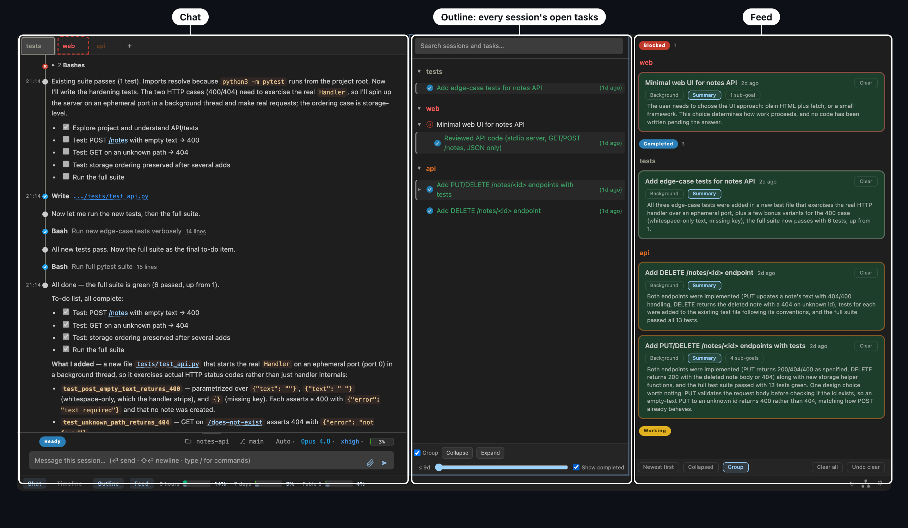{ width="100%" }

### The chat

The transcript, condensed for scanning: tool calls fold into runs so a long
session stays legible. Expand a run for its calls, and a call for its full input
and output.

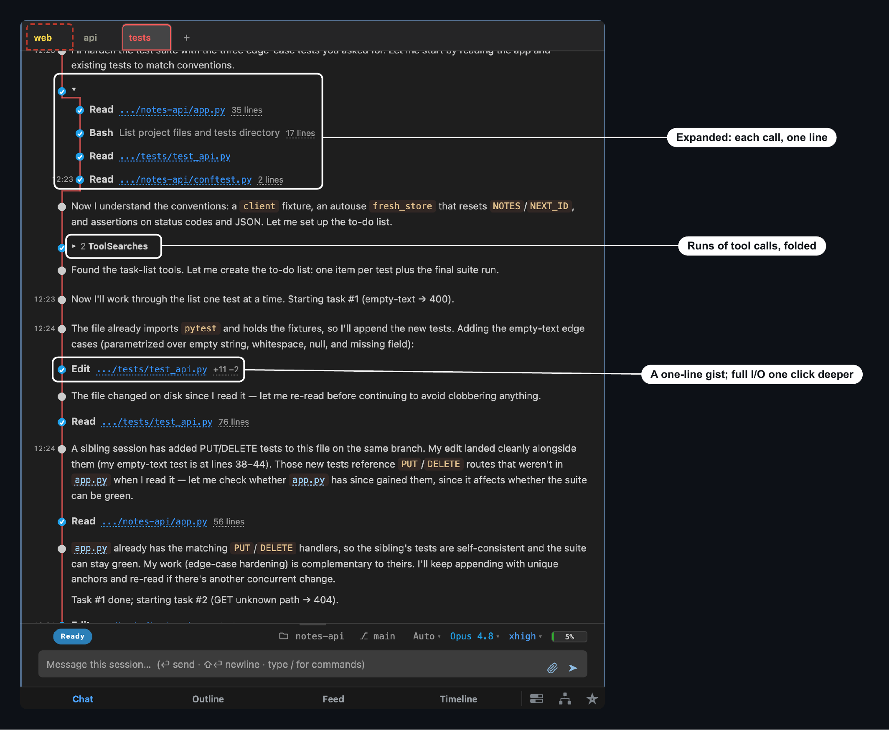{ width="100%" }

### The feed and task cards

The feed is the one view without an everyday equivalent, so it is worth a
moment. Instead of reading transcripts to track what each agent did, you read
task cards: Romp's [judges](judges.md) watch each session's work, break it into
discrete tasks, and keep every card current, with no reporting step for the
agent and no filing step for you. Cards land in three columns: moving on its
own, waiting on you, and finished. A completed card carries its takeaway, so
you read the outcome without opening anything.

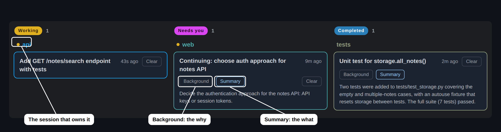{ width="100%" }

The title is the gist. **Background** is why the work exists: what led to it and
whose ask it is. **Summary** is what the agent did, written to stand on its own.
Sub-tasks nest beneath when the work splits. Each level is one click, so you
spend attention only where the work earns it.

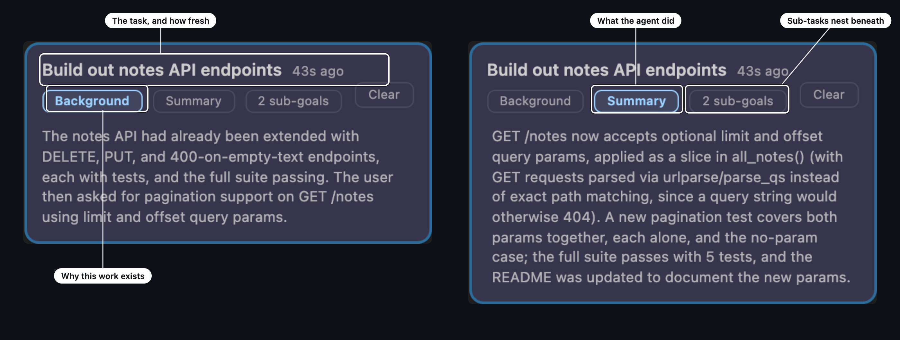{ width="100%" }

Cards follow the work rather than the session: a session that interleaves
several efforts gets a card per effort, and one effort handed across sessions
stays a single card, so a handoff never drops a thread. Summaries favor the
latest stretch of work, and a card you return to after hours away tells you
what changed since you last looked. When you're done with a card, **Clear** it;
cleared cards are archived.

### The outline

Every session with its task tree: open work stays up top, finished work folds
beneath. Open the outline to review what a session has worked through, or to
find past work: the search box reaches every session, live or closed.

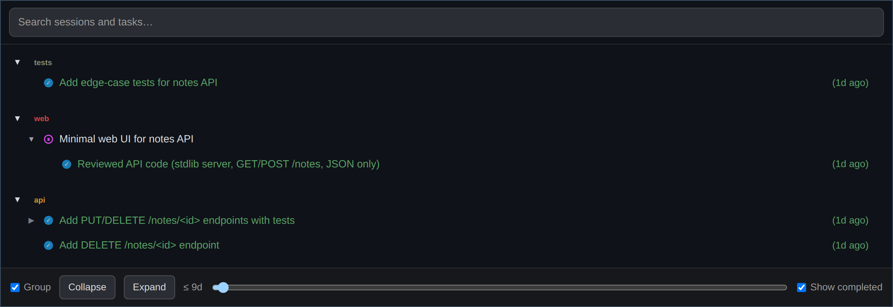{ width="100%" }

### The timeline

Each lane is one session; bars are stretches of work.

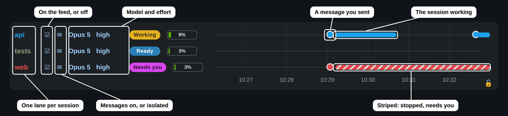{ width="100%" }

The story of any bar is a hover away:

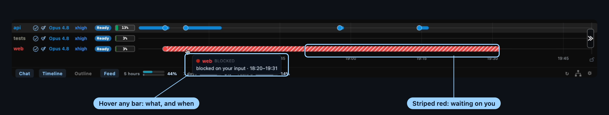{ width="100%" }

Click a bar or a message marker to jump straight to where it happened in the
chat.

A session wears the same color for its state everywhere it appears: its tab, its
timeline lane, its cards.

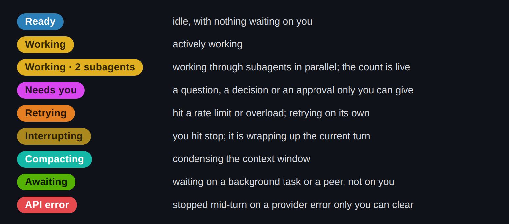{ width="70%" }

## Automatic nudges

To keep agents moving forward whenever your input isn't needed, Romp nudges a
stalled session back to its open work: when it hit an API error, when it was
interrupted, or when it simply stopped with a task still open and never said
whether the task was done.

Romp asks the agent, item by item, where each open piece stands: continue what
it can, and say what blocks the rest.

- If the agent can keep going, it does, and you were never interrupted.
- If something needs you, the card flips to **Blocked** and names exactly what
  it needs.

Either way you only get pulled in when you are the bottleneck.

Nudging holds off while you are actively driving a session, and it re-arms only
after a real turn ends, so it never talks over you and never loops on its own
messages.

A session can also be waiting on something that is not you. When it dispatches
work and pauses for the result, it shows a green **Awaiting** chip on the fleet
rail, on the chat statusline above the message box, and on its timeline lane,
where the pending stretch is drawn faded. Awaiting never means it needs you: it
means the work is in flight until what the session sent for comes back. The
chip clears on the session's next turn, when the task finishes or blocks, when
you clear the card, or as soon as you reply.

## Messaging between agents (the Romp Postal Service)

Sessions message each other through a mailbox Romp gives them, and every
exchange is visible to you. Each session gets mail tools: send a message to a
session by name, check the inbox, see who is live and what they hold. Agents
use them to ask each other questions, hand off work, and announce results.

You can see which agents have been communicating on the timeline:

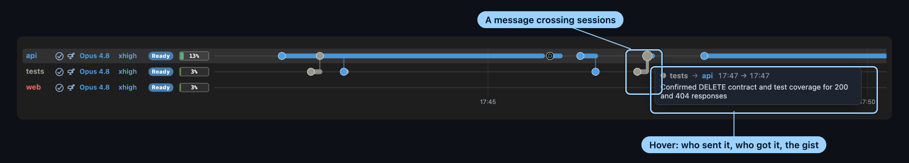{ width="100%" }

You can also see it in the chat:

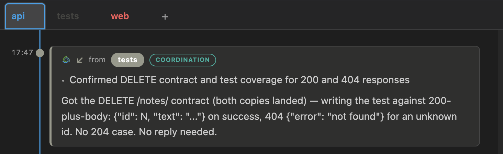{ width="80%" }

Every message declares what it is: **delegate** (the recipient owns the work
now), **coordinate** (a heads-up; reply optional), or **question** (an answer
is required). The declaration travels with the message, so the recipient and
the task cards treat it accordingly.

The same mailbox is on the command line, for you and for scripts:

```bash
romp --mail send --kind question api "Which auth approach did we settle on?"
romp --mail inbox
```

The full mail surface, shell and in-session, is in the
[Reference](reference.md#mail-from-the-shell). Names resolve against the
currently live sessions; sending to a dead session's name errors instead of
silently parking mail.

## Sessions, revival, and search

A Romp session is a name that outlives any one conversation. Its identity
survives `/clear`, relaunches, and kernel restarts, and each name keeps its own
color on every surface, so `api` is the same `api` wherever you see it.

Type a closed session's name into the picker and it offers to revive it: the
session comes back live with its history intact. Stepping away, or shutting the
laptop, costs nothing.

The picker matches against every session, live or closed. As sessions run, a
lightweight index judge writes each one a headline and an abstract of what it
did, so the search reaches inside a session's work, and many sessions stay
navigable months later.

Which backend a session runs on (Agent SDK or tmux) is a per-session choice;
[Session backends](reference.md#session-backends) covers the difference.

## Self-hosted and remote access

You run Romp on your own machine; there is no hosted service in between. The
kernel runs there and serves the dashboard on `127.0.0.1:29855`, to a browser
tab or the VS Code / Cursor extension. Everything Romp stores stays local; the
only traffic that leaves your machine is `claude` itself, both the agents' own
model calls and the LLM calls in Romp's judge pipeline.

### More machines, one place

Federation connects more than one machine: each runs its own kernel, and an
attached machine's sessions join yours in the same dashboard, so their agents
message each other across the boundary and you steer them all from one place.

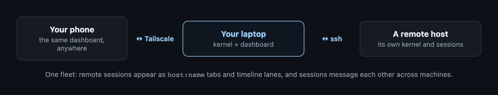{ width="100%" }

Once a host is attached:

- Its sessions appear as `host:name` tabs and timeline lanes next to your local
  ones, and you drive them from the same chat.
- Its task cards share the feed, so one glance covers every machine.
- Sessions message each other across machines through the same postal service,
  so an agent on your desktop can hand work to one on the server.

Setup is one install and one click:

1. On the remote machine: clone romp and run `./install.sh` (`ROMP_NO_EXT=1`
   skips the editor extension on a headless box). Make sure `ssh <host>` works
   non-interactively.
2. In your dashboard: click the network button at the bottom right and attach
   the host.

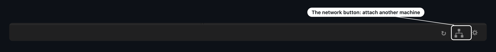{ width="100%" }

The attach fetches the remote kernel's token over ssh, opens the tunnels, and
starts the remote kernel if it isn't running.

The popover remembers every host you have attached. Detaching one moves it to a
**Previously attached** list rather than dropping it, so bringing it back is one
click (**Re-attach**) instead of hunting through the ssh-config dropdown — and it
keeps the trust level you last chose, so a machine you marked `trusted` doesn't
quietly come back as `directed`. **Forget** removes a host from that list; it
does nothing to the machine itself. Every status word and button in the popover
explains itself on hover, so none of this needs the command line.

#### Trust levels: hold untrusted mail for approval

A message that lands in an agent's context can steer it, so each attached host
carries a trust level you set on its row in the network popover (remembered per
host):

- **trusted** — full two-way postal, for a machine you control.
- **directed** (the default for a newly attached host) — you can send work *to*
  its sessions, but its mail *to* you is held for approval. Each held message
  becomes a needs-you card ("incoming postal message from X to Y") with
  **Approve** (deliver), **Edit** (change the text first), and **Deny** (drop),
  so a human decides before any of that host's content reaches one of your
  agents. This is the safe posture for rented or shared compute (a cloud VM, a
  RunPod box): you can drive the box, it cannot drive you.
- **isolated** — no postal at all; the host's sessions still show in the
  dashboard, but its bus never peers with yours.

Because a federated machine's root can read anything on that box, keep only
scoped, revocable credentials there. For a check-in hub, restrict the key the
roaming machine uses to forwarding only — a line like

    restrict,port-forwarding ssh-ed25519 AAAA... romp-tunnel

in the hub's `~/.ssh/authorized_keys` lets a leaked key open the romp tunnels
but never a shell or command.

### Your laptop, anywhere (check-in)

A roaming machine can publish itself to an always-on hub over its own
*outbound* ssh — the hub never holds credentials into it. Tick **keep
connected** on the hub's row in the network popover (or run
`romp checkin <hub>`): the attach tunnel gains reverse forwards for this
machine's kernel and postal bus, and a handshake hands the hub its ports and
dashboard token. From then on the hub's dashboard — and your phone through
it — sees and drives this machine's sessions whenever it is online, from any
network. The two postal buses peer over the same tunnel: messages flow both
ways, and mail for an unreachable machine parks in an outbox and delivers on
reconnect (or bounces back loudly if the recipient is gone). Untick the box
(or `romp checkout <hub>`) and the hub forgets the machine and its token.

Every machine runs its own postal bus, so a laptop off the network keeps full
local messaging; connecting only ever adds reach. (Set `ROMP_POSTAL_PEERS=0`
to select the legacy single-bus scheme.)

### Your phone

The kernel never listens beyond `127.0.0.1`. To reach it from your phone, let
[Tailscale](https://tailscale.com) carry the traffic: `tailscale serve` proxies
HTTPS at your machine's tailnet name to the loopback port, on the machine
itself.

```bash
tailscale serve --bg 29855     # https://<machine>.<tailnet>.ts.net -> 127.0.0.1:29855
tailscale serve status        # show the active proxy
tailscale serve reset         # back to local-only
```

With Tailscale on the phone, the full dashboard is in your pocket: check the
feed, answer a blocked card, start a session. On the phone's **first** open,
append the access token — `https://<machine>.<tailnet>.ts.net/?token=<token>`,
with the token from `romp launch` (or paste it into the page a bare open
serves); a year-long cookie remembers the phone after that. Only devices
signed into your tailnet can connect (WireGuard device identity plus TLS);
nothing is opened to your LAN or the internet, and the proxy persists across
restarts of both Tailscale and the kernel. Still don't use `tailscale funnel`
(the public-internet variant): the token would then be the only thing between
the internet and your agents, with no device identity in front of it.

### Security

Romp drives agents that run tools and shell commands as you, so reaching its
API is equivalent to running code as you. Everything below follows from that.

**One token, required on every request.** The kernel and the postal bus both
demand a token on every request — *including from `127.0.0.1`*. Loopback is not
a security boundary: on a multi-user machine every local account can reach your
ports, so without this any other user could inject prompts into your live
sessions. The token is 144-bit random and lives at
`~/.local/state/romp/serve-token` with mode `0600` — **file permissions are the
actual gate**. Local tools (the CLI, hooks, the bus, the editor extension) read
that file and send it automatically; you never type it. Only liveness probes
(`/healthz`, `/version`, `/busy`, and the bus's `/ping`) are exempt.

**Getting in.** Run `romp launch`: it prints the tokened link *and* opens your
browser. The first visit exchanges the token for a year-long `HttpOnly` cookie,
so afterwards plain `http://127.0.0.1:29855/` just works. Opening that bare URL
without a cookie shows a paste-the-token page rather than a dead error.

**Remote machines.** Every machine mints its **own** token. When you attach a
host, your machine reads that host's token over ssh and stores it locally (in
`~/.local/state/romp/remotes.json`, also `0600` — it is a credential store).
Dashboard traffic to a remote never crosses the network in the open: it rides
the ssh tunnel, which supplies encryption and machine identity, while the token
authorizes at the far end. Check-in reverses the direction — credentials always
flow *outward* from the machine that initiates, so a hub never holds a way in.

**Federated messages are gated by trust.** A message that reaches an agent's
context can steer it, so each attached host carries a trust level — `trusted`,
`directed` (the default), or `isolated`. A `directed` host's mail is held for
your approval instead of being delivered; see [Trust levels](#trust-levels-hold-untrusted-mail-for-approval).

**What this does not protect against.** Root on a machine can read any file
(including the token) and inspect any process — no userspace design changes
that, so don't keep long-lived credentials on a box whose root you don't trust.
Likewise, anything already running as *you* can read the token: same-machine
sessions are separated by policy, not by this boundary. The enforceable lines
are per-user (the token file) and per-machine (the trust level).

Full details, including how to report a vulnerability, are in
[SECURITY.md](https://github.com/romp-on/romp/blob/main/SECURITY.md).

## How many tokens does Romp use?

The judges read your transcripts to build the task cards, so Romp spends tokens
on top of the sessions you run yourself. In practice that stays modest, because
the judging runs on cheaper models than the work: the high-volume indexing tier
is Haiku, the judgment tier is Sonnet, while your own sessions use whatever you
picked for them.

That split is the recommendation, not just the default. Keep the judges on the
smaller models and the work on the larger ones: Haiku and Sonnet for judging,
Opus or Fable for the work itself. Both are yours to change from the gear, under
**Indexing model** and **Triage model**.

You don't have to take any of that on trust. The analytics modal reports what you
actually spent over any period, separating your sessions from the judge pipeline
and breaking the pipeline down per judge and per tier, with a toggle between
tokens and dollars.
