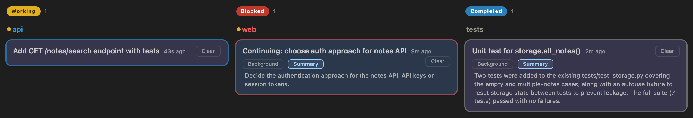
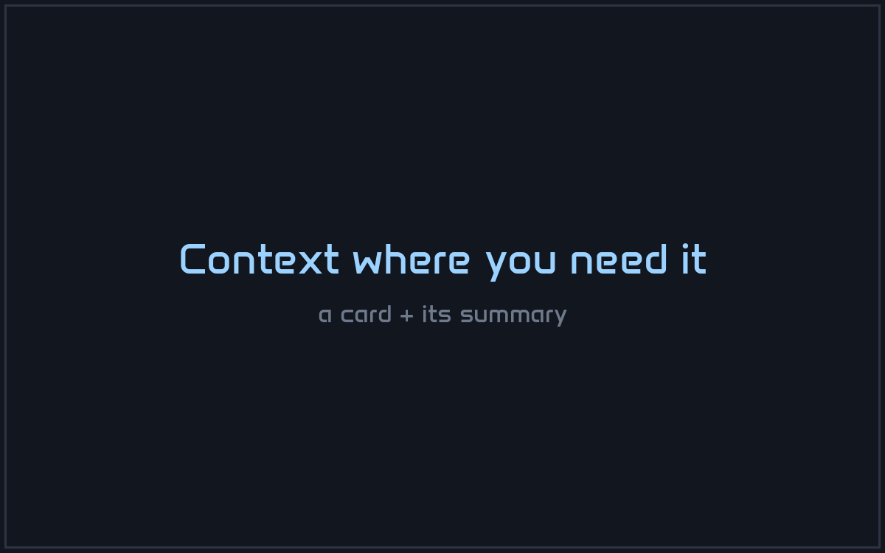
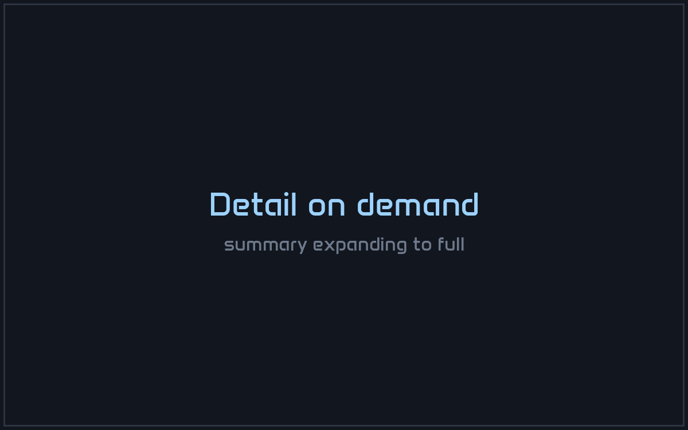
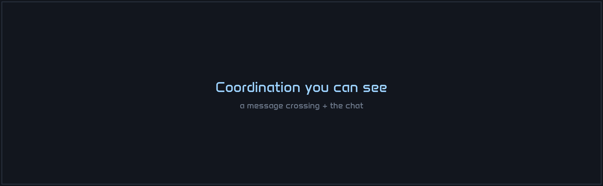

# Romp

AI agents like Claude Code can work autonomously for long stretches, so
running several in parallel multiplies what you can accomplish. But it also
means more to manage: keeping track of which agent is doing what,
scrolling through transcripts to find the background a
decision needs, checking in to see which agents are stuck, and coordinating
handoffs of work and context.

Romp provides the tools to make this management seamless, so you can stay
focused on what you're trying to accomplish instead of how the work is
happening. It does this by keeping track of every agent and the tasks it is
working on, surfacing what needs your attention and keeping the rest moving on
its own:

<!-- Feature grid. Images are placeholders in docs/assets/ — replace each file in
     place (keep the name) as the real capture is recorded; the README grid
     points at the same files. Swapping a .png for a .gif means updating the
     src in both. -->
<div class="grid cards" markdown>

-   

    **Everything at a glance**

    What's running, what's stuck, and what needs your attention.

-   

    **A task management layer**

    Automatically inferred from the transcripts, so nothing gets lost.

-   

    **Context where you need it**

    What the agent did and why, without having to scroll through transcripts.

-   

    **Detail on demand**

    From a one-line summary to the full exchange.

</div>



**Coordination you can see**

Agents asking each other questions and handing off tasks, through a mailbox Romp
gives them.

Romp adds all of this on top of the agents you already run, whatever they are
and whatever tools they use, without changing how you work.

## Self-hosted, reachable from anywhere

You run Romp yourself, on your laptop or a server, with no hosted service in
between. Connect several machines over SSH and they federate into one fleet
whose agents message across the boundary. Open the dashboard in a browser or
as a VS Code / Cursor extension, and reach it from your phone over Tailscale
to check in or keep a conversation going. The only traffic that leaves your
machine is the `claude` CLI you already use.

## Quick start

```bash
git clone https://github.com/romp-on/romp.git
cd romp
./install.sh
export PATH="$PATH:$(pwd)/bin"   # add this to your shell rc
```

Then open `http://127.0.0.1:7433/` in any browser and start a session. Full
requirements, remote-host setup, and configuration are in
[Getting started](getting-started.md).

## See it in action

Romp presents the fleet through four views: the feed (work as task cards), the
fleet (every session with its open tasks), the timeline (sessions over time and
where they interact), and the chat you already know.

<!-- TODO: screenshots / short GIFs go here. The five feature captures live in the
     grid above (docs/assets/tile-*.png); these are the ones still unshot:
     - The four views side by side: feed, fleet, timeline, chat.
     - Reviving a closed session with its history intact.
     - Reaching the dashboard from a phone over Tailscale.
     - The VS Code / Cursor extension panel beside a browser tab (same fleet, two surfaces).
-->

