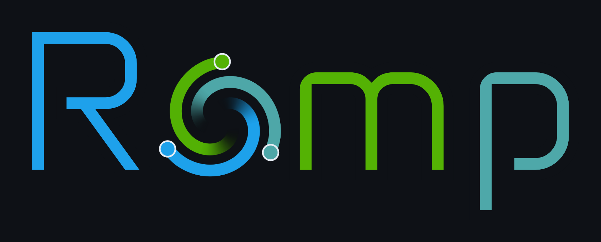
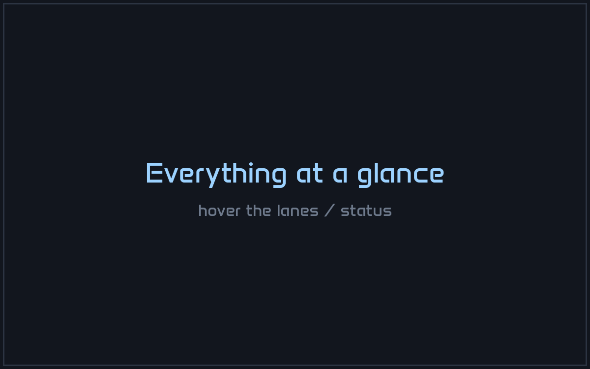
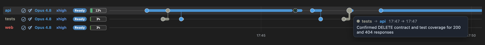
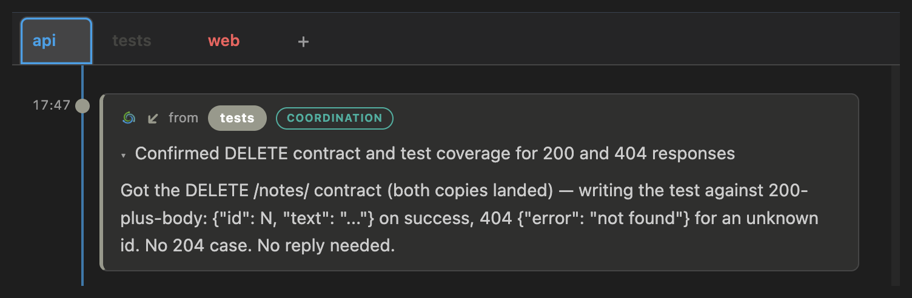

# { .romp-wordmark }

AI agents like Claude Code can work autonomously for long stretches, so
running several in parallel multiplies what you can accomplish. But it also
means more to manage: keeping track of which agent is doing what,
scrolling through transcripts to find the background a
decision needs, checking in to see which agents are stuck, and coordinating
handoffs of work and context.

Romp provides the tools to make this management seamless, so you can stay
focused on what you're trying to accomplish instead of how the work is
happening. It does this by keeping track of every agent and the tasks it is
working on, surfacing what needs your attention and keeping the rest moving on
its own.

Romp is built on top of Claude Code: the agents it manages are ordinary
Claude Code sessions, gathered into one live dashboard. Run it on your laptop,
on a server, or across [several machines at once](guide.md#more-machines-one-place):
their agents message each other across the boundary, and you steer them all from
one place. You open that dashboard the same way from anywhere: a browser,
[your phone](guide.md#your-phone), or the VS Code / Cursor extension.

Its key features:

<!-- Feature sections. Real captures live in docs/assets/; the README points at the same files.
     The docs home embeds the MP4 in a <video> for the last feature; the README embeds the GIF. -->

## Every session, one timeline

What's running, what's stuck, and what needs your attention.

{ width="100%" }

## Task management

Automatically generated by analyzing agent transcripts, it tracks all the work so you don't have to.

<video src="assets/guide/task-cards.mp4" autoplay loop muted playsinline width="100%"></video>

## Context where you need it

What the agent did and why, without having to scroll through transcripts. One
click flips a card between its background, its summary, and its sub-tasks.

<video src="assets/guide/context-tabs.mp4" autoplay loop muted playsinline class="romp-card-demo"></video>

## Coordination you can see

Agents asking each other questions and handing off tasks, through a mailbox Romp gives them.

{ width="100%" }

{ .romp-narrow }

## Detail on demand

Hover a work bar, open a summary, expand a tool call, and more.

<video src="assets/overview.mp4" autoplay loop muted playsinline width="100%"></video>
