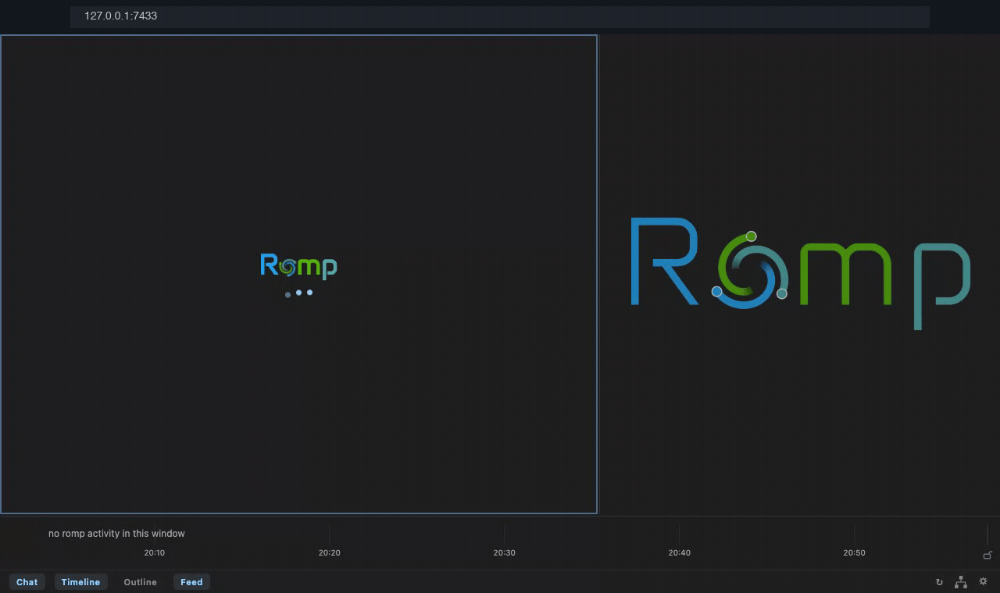

# Install

Romp installs from source with one script. Three things need to be in place
first.

## Before you install

- **[Claude Code](https://docs.claude.com/en/docs/claude-code), signed in.**
  Install it and run `claude` once to log in. Romp runs on your existing Claude
  Code login and adds no account of its own.
- **Python 3.10 or newer.**
- **Node.js.**

On macOS, install Python and Node with [Homebrew](https://brew.sh):

```bash
brew install python node
```

On Ubuntu or Debian:

```bash
sudo apt install python3 nodejs npm
```

## Install

```bash
git clone https://github.com/romp-on/romp.git
cd romp
./install.sh
export PATH="$PATH:$(pwd)/bin"   # add this line to your shell rc
```

The installer registers Romp with Claude Code (the hooks, the postal service,
the `romp` skills, and the VS Code / Cursor extension) and keeps the kernel
running from login on.
[What it installs, in detail](reference.md#what-the-installer-sets-up).

## First run

The installer starts Romp and keeps it running, so the dashboard is already
live. Open **http://127.0.0.1:7433/** in any browser, type a name into the
picker, and start a session.

{ width="100%" }

Prefer your editor? Reload your VS Code or Cursor window and open Romp from the
sidebar. The installer already added the extension.

From here, the [Guide](guide.md) tours the four views and everything Romp does
with your sessions.
