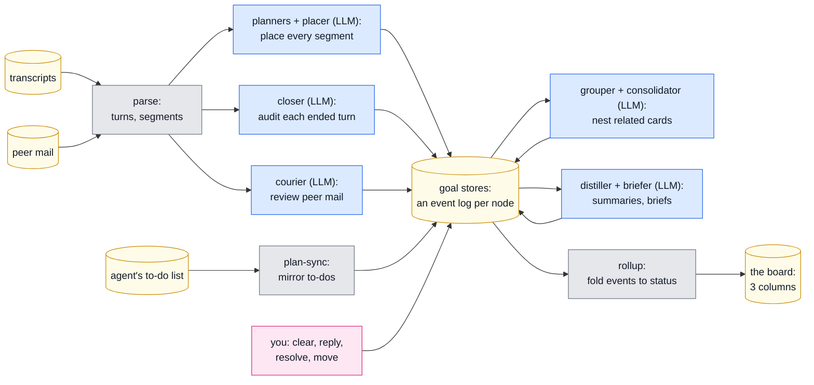
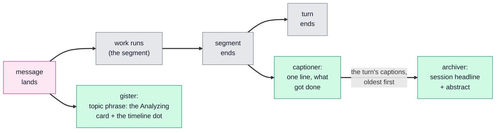
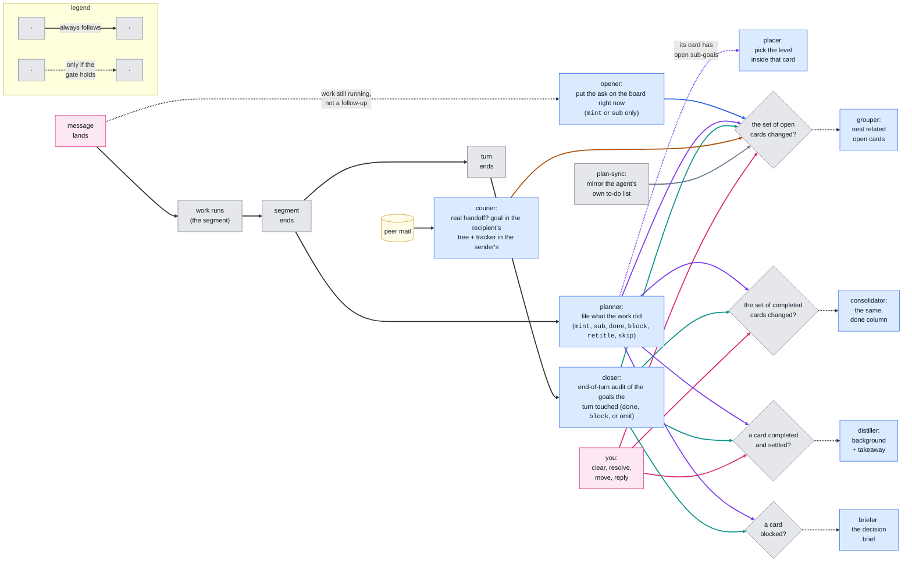
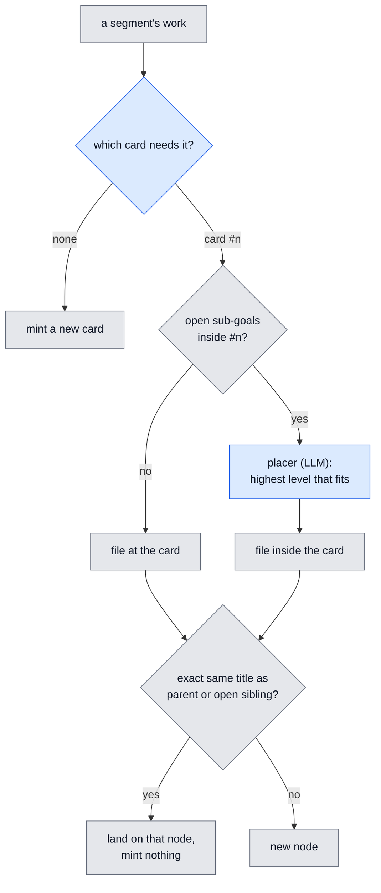
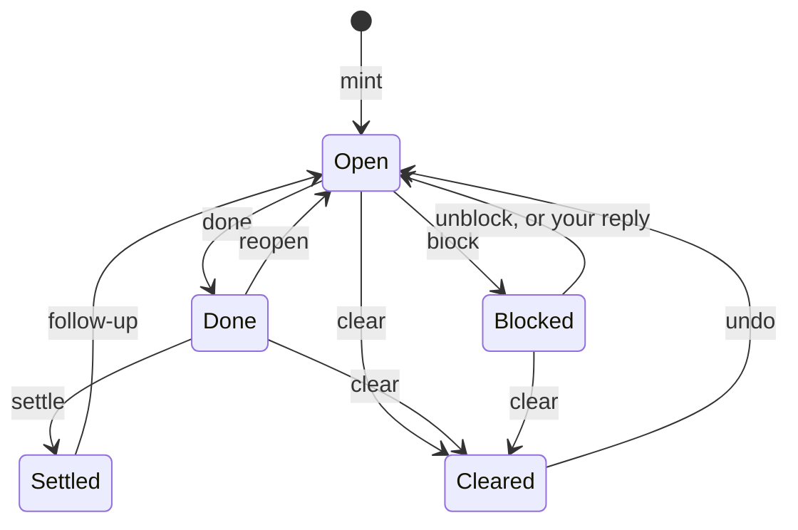
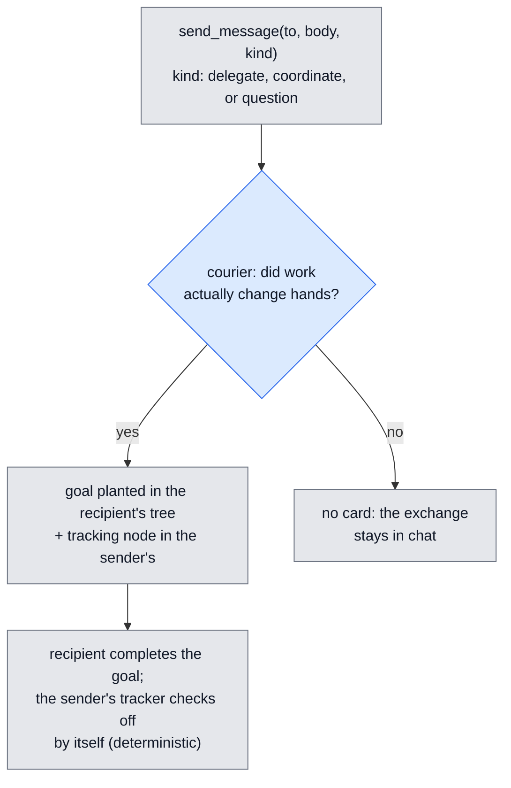

# The judge pipeline

Every state on the board is a replay of appended events. Judges append, your
actions append, and nothing edits state in place, so any behavior can be
walked back to the events that produced it. This page shows who appends what,
in which order, and where each record lives. Companion detail:
[judges.md](judges.md) (per-judge prompts and triggers) and
[goal-state.md](goal-state.md) (the event model). Current as of 2026-07-09.

Reading the diagrams: blue = an LLM board judge (writes goal state), green =
an LLM caption judge (writes only text), gray = deterministic code, yellow =
data at rest, pink = you. A solid arrow always follows; a dashed arrow fires
only when its condition holds.

## The whole system

Transcripts and peer mail become segments; judges turn segments into events
on per-node logs; a deterministic rollup folds those logs into the board.
The LLM judges sit between two deterministic layers, so every judgment is
recorded and replayable.

Order within one pass: planner, closer, courier, propagate (deterministic
check-off of delegated work), grouper, consolidator, distiller + briefer.
Every LLM call goes through one door that skips calls while an account usage
window is exhausted, turns an API error reply into a logged call failure
(never parser input), and logs cost per judge, one name per distinct prompt.
Every judge gives up loudly after three rejected replies on the same work
item and re-arms on its own event (judges.md, "When a judge fails"). A
separate Haiku tier (captioner, gister, archiver) writes the chat and
timeline captions; it never touches goals.

## When each judge runs

A turn is your message, the work it causes, and the stop at the end. A
segment is one input and its work; a turn can hold several (your message,
then a peer's message, each with its own work). The two tiers are separate
systems, so each gets its own figure.

**The caption tier** (green) writes the words you read — chat, timeline,
search — and never touches a card. Every arrow is unconditional.

**The board tier** (blue) files and rules. A solid arrow always follows; a
dashed arrow fires only when the gray gate on its path holds — the gates
are deterministic checks, not model calls, and they are why nothing here
follows the clock.

Edge colors carry no meaning beyond tracing which node an arrow leaves:
purple = planner, teal = closer, pink = you, blue = opener, amber =
courier, slate = plan-sync. The planner and closer are not alternatives:
every segment's work is filed by the planner, including the turn's last,
and the closer then runs once more at turn end to audit the goals the whole
turn touched (within a pass, always planner first, then closer).

The diamond gates are the event gating: the grouper keys on the set of open
cards (top-level ids) and the consolidator on the set of completed cards,
so they run after any source that changes those sets — the filing judges,
the courier's planted goals, the plan-sync mirrors, or your own
clear/resolve/undo — and stay silent when a pass changes nothing. The
distiller and briefer key on a single card's state (completed-and-settled,
blocked) regardless of which judge put it there. The placer is the
planner's second, scoped call only: the opener and the live re-plan always
hard-place at card level.

The board judges, with what each one reads and the ops it may emit:

| Judge | Fires when | Reads | May do |
|---|---|---|---|
| opener | your message lands, work still running | the message + the open-card tree | exactly one op: `mint`, or `sub` under an open card |
| planner | a segment's work ends | the work + the tree | `mint`, `sub`, `done`, `block`, `retitle`, `skip` |
| placer | the planner filed under a card that has open sub-goals | that card's subtree only | pick the level inside the card |
| closer | the turn ends | the goals this turn touched | `done`, `block`, omit (when in doubt, omit) |
| courier | a peer message arrives | the message + both sessions' trees | plant a goal + tracking node, or nothing |
| grouper | the set of open cards changed | open top cards | nest a card, mint an umbrella, nothing |
| consolidator | the set of completed cards changed | completed top cards | the same ops, done column |
| distiller | a card completed and settled | the card's whole work (or the delta since a reopen) | background + takeaway |
| briefer | a card blocked | the blocking stretch | the decision brief |

Two special inputs change how the planner reads a segment: a segment opened
by a goal-tagged nudge must resolve that goal (done or block, no plain
step), and a segment opened by an untargeted kernel notice (restart/resume)
carries a housekeeping note, so a post-restart verification sweep files
nothing instead of minting its own card.

## Placement is one question: which card

For each segment the planner answers: which open card could not be called
done without this work? No card qualifies, mint a new one. Everything after
that answer is mechanical, including where inside the card the work lands.

Timing details that matter when auditing: a user message is placed twice.
The opener files it the moment it lands (card level only, so the board
updates instantly); the planner's work run refines at turn end and may add,
complete, block, or retitle. A placer or opener failure files at the card,
never nowhere, and logs to judge-errors.jsonl. The same-title guard is exact
string equality, and a completed sibling never matches, so repeated steps
still get their own nodes.

## A node's state is a replay of its log

Nothing stores "blocked" or "done" as a fact. Each node carries an
append-only log of events, each stamped with its source (planner, closer,
courier, nudge, interrupt, romp, user, agent) and reason; the visible state
is a fold over that log. A direct state write raises at the write site. The
grouper and consolidator never appear as sources: they move whole subtrees,
they never judge.

Three derived flags answer the questions the chart cannot:

| Flag | Meaning | Cleared by |
|---|---|---|
| held | you asserted "not done" and no judge has answered | any later non-user event on the node |
| followupPending | your reply is being re-judged (the card's swirl) | the planner's next verdict, or a pivot |
| stale-verdict guard | a done/block computed from evidence at or before your last reply is refused | newer evidence |

## Three columns, one precedence

The rollup folds a card's subtree into a column, in this order:

1. Any open descendant blocked, or the card itself: **Needs you**.
2. Subtree done and settled, and the card is not held: **Completed**.
3. Otherwise: **Working**.

Two overrides sit above the judges: an open item on the agent's own to-do
list holds its card in Working regardless of verdicts, and your actions
(clear, resolve, move) outrank both. Completion sticks via a settle event,
so a finished card does not flicker back to Working when late work trickles
in; only a real follow-up reopens it.

## Peer mail: the sender declares, the courier verifies

A sender must declare each message delegate, coordinate, or question in the
send call itself; the courier takes the declaration as a strong prior and
reads the body for the receiving-side truth. Only a real handoff makes
cards: one in each tree, linked, and the link checks itself off.

## Walk any surprise back to its cause

| Question | Read this |
|---|---|
| why is this card in this state? | the node's `log` in `goals/<sid>.json`: every event has source, kind, reason, time |
| why was this work filed here? | `placements` in the store, plus the node's `why` and `trail` |
| why did this mint at top level? | the node's `why`: "declared in the agent's own to-do list" means the plan-sync mirror, and nesting it is the grouper's job; anything else is the planner |
| did a judge fail or get skipped? | `judge-errors.jsonl`: every row carries judge, session, kind (parse, call, give-up, cite-miss, rate-limited, task-store, history-unreadable), and the evidence (reply tail, API message, re-arm event); rows before 2026-07-08 use the family names |
| what did a judge call cost, and when? | `judge-usage.jsonl`, per judge and session |
| what happened to a peer message? | `timeline/messages.jsonl` by message id, plus the delivered markers in the transcript |
