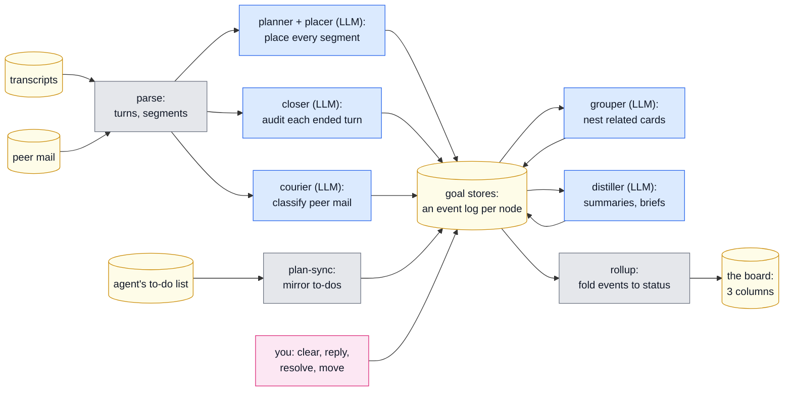
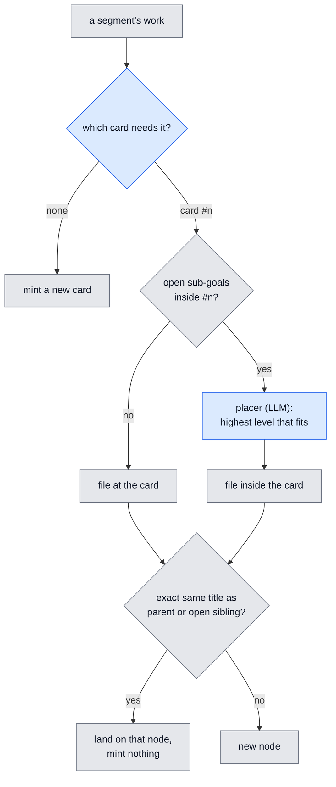
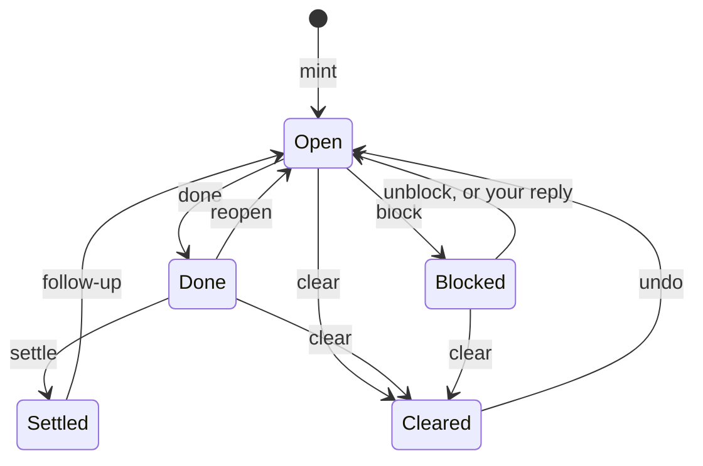
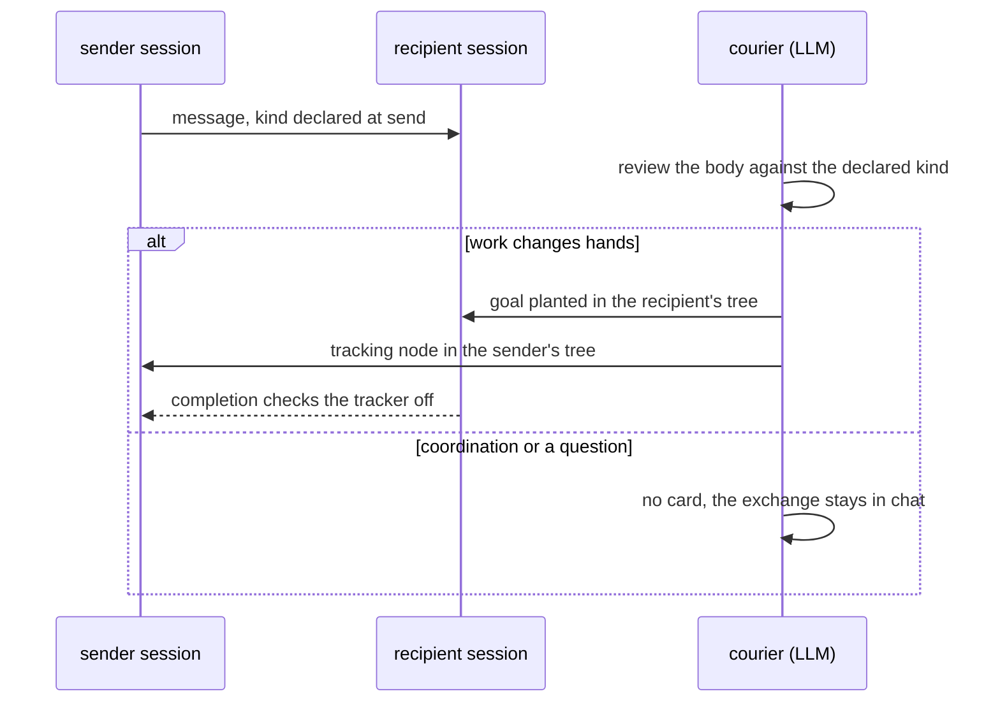

# The judge pipeline

Every state on the board is a replay of appended events. Judges append, your
actions append, and nothing edits state in place, so any behavior can be
walked back to the events that produced it. This page shows who appends what,
in which order, and where each record lives. Companion detail:
[judges.md](judges.md) (per-judge prompts and triggers) and
[goal-state.md](goal-state.md) (the event model). Current as of 2026-07-08.

Reading the diagrams: blue = an LLM judge, gray = deterministic code,
yellow = data at rest, pink = you.

## The whole system

Transcripts and peer mail become segments; judges turn segments into events
on per-node logs; a deterministic rollup folds those logs into the board.
The LLM judges sit between two deterministic layers, so every judgment is
recorded and replayable.

Order within one pass: planner, closer, courier, propagate (deterministic
check-off of delegated work), grouper, consolidator, distiller. Every LLM
call goes through one door that skips calls while an account usage window is
exhausted and logs cost per judge. A separate Haiku tier writes the chat and
timeline captions; it never touches goals.

## Placement is one question: which card

For each segment the planner answers: which open card could not be called
done without this work? No card qualifies, mint a new one. Everything after
that answer is mechanical, including where inside the card the work lands.

Timing details that matter when auditing: a user message is placed twice.
The prompt-run files it the moment it lands (card level only, so the board
updates instantly); the work-run refines at turn end and may add, complete,
block, or retitle. A placer failure files at the card, never nowhere. The
same-title guard is exact string equality, and a completed sibling never
matches, so repeated steps still get their own nodes.

## A node's state is a replay of its log

Nothing stores "blocked" or "done" as a fact. Each node carries an
append-only log of events, each stamped with its source (planner, closer,
courier, grouper, nudge, interrupt, romp, user, agent) and reason; the
visible state is a fold over that log. A direct state write raises at the
write site.

Three derived flags answer the questions the chart cannot:

| Flag | Meaning | Cleared by |
|---|---|---|
| held | you asserted "not done" and no judge has answered | any later non-user event on the node |
| followupPending | your reply is being re-judged (the card's swirl) | the planner's next verdict, or a pivot |
| stale-verdict guard | a done/block computed from evidence at or before your last reply is refused | newer evidence |

## Three columns, one precedence

The rollup folds a card's subtree into a column, in this order:

1. Any open descendant blocked, or the card itself: **Needs you**.
2. Subtree done and settled, and the card is not held: **Completed**.
3. Otherwise: **Working**.

Two overrides sit above the judges: an open item on the agent's own to-do
list holds its card in Working regardless of verdicts, and your actions
(clear, resolve, move) outrank both. Completion sticks via a settle event,
so a finished card does not flicker back to Working when late work trickles
in; only a real follow-up reopens it.

## Peer mail: the sender declares, the courier reviews

A sender must declare each message delegate, coordinate, or question in the
send call itself. The courier treats the declaration as a strong prior and
reads the body for the receiving-side truth: did work actually change hands?

## Walk any surprise back to its cause

| Question | Read this |
|---|---|
| why is this card in this state? | the node's `log` in `goals/<sid>.json`: every event has source, kind, reason, time |
| why was this work filed here? | `placements` in the store, plus the node's `why` and `trail` |
| why did this mint at top level? | the node's `why`: "declared in the agent's own to-do list" means the plan-sync mirror, and nesting it is the grouper's job; anything else is the planner |
| did a judge fail or get skipped? | `judge-errors.jsonl`: parse failures, give-ups, rate-gate skips |
| what did a judge call cost, and when? | `judge-usage.jsonl`, per judge and session |
| what happened to a peer message? | `timeline/messages.jsonl` by message id, plus the delivered markers in the transcript |
