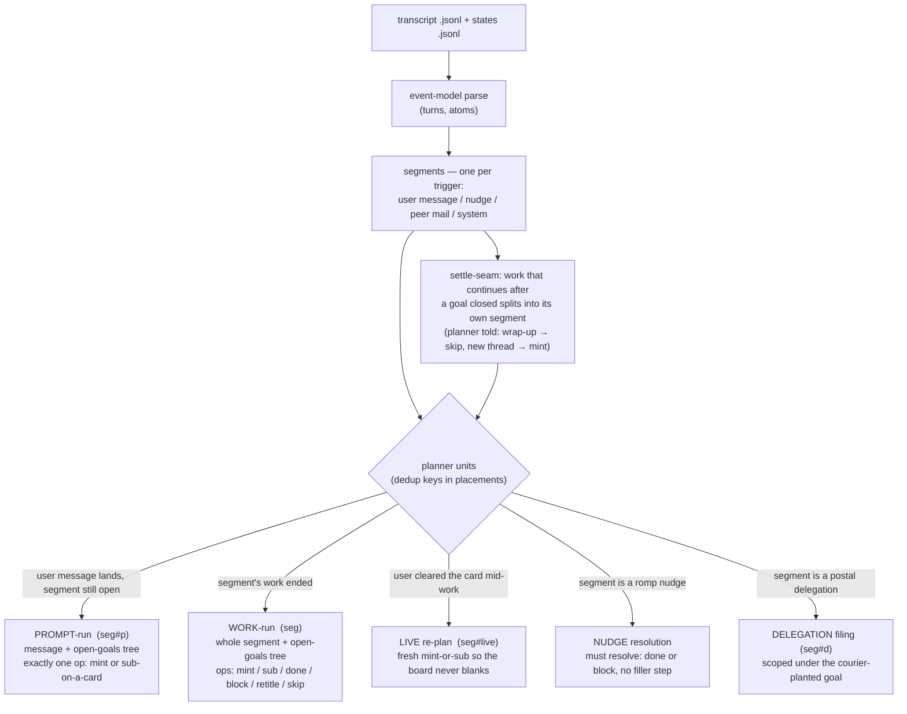
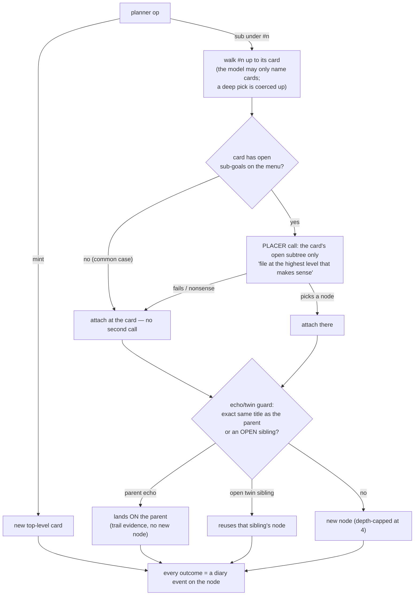
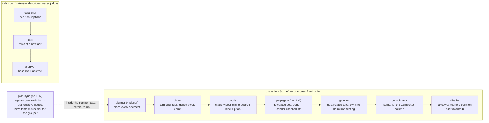
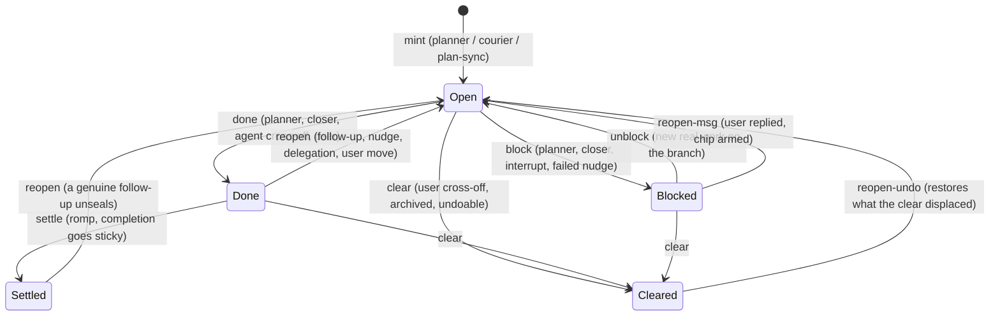
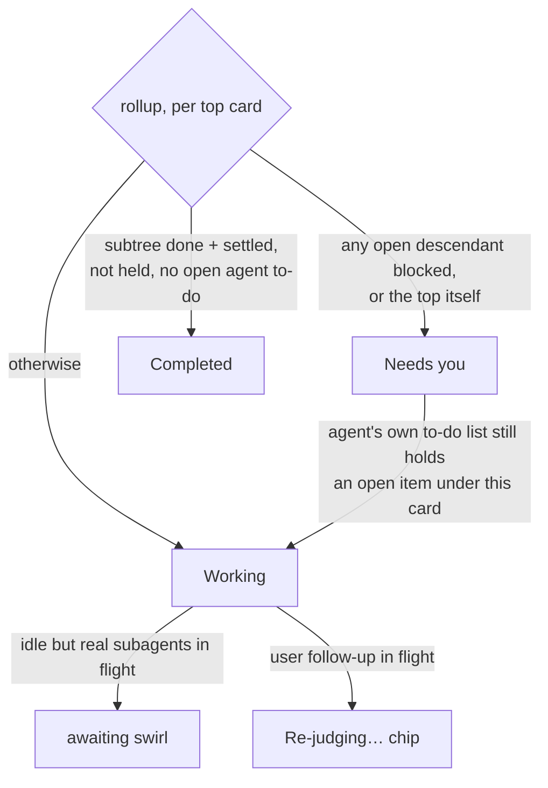
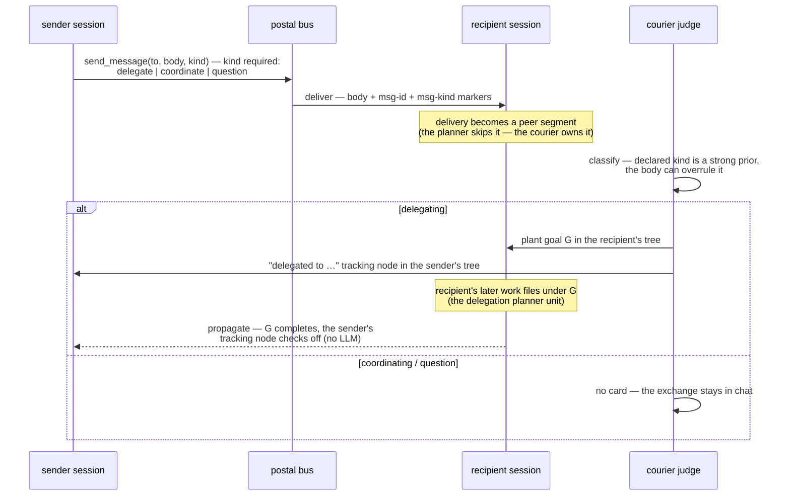

# The judge pipeline, in diagrams

A one-page audit map of how a session transcript becomes the board: what gets
parsed, which judges run in what order, what each one is given, and every state
a goal node can be in. Companion to [judges.md](judges.md) (prose, per-judge
detail) and [goal-state.md](goal-state.md) (the diary event model). Current as
of 2026-07-08 (card-first filing, the placer, the declared postal kind).

## 1. From transcript to placed work

Everything starts as a transcript line. Parsing slices it into turns, turns
into **segments** (one per trigger — a user message, a nudge, a peer message),
and each segment becomes one or two planner **units** keyed in `placements` so
no segment is ever judged twice.

## 2. Where a `sub` lands — card-first filing

The planner never picks a deep node. It picks the **card** (the top-level goal
you see on the board); a second, scoped call — the placer — picks the spot
inside, and only when there is a real choice to make.

Prompt-run and live re-plan skip the placer (latency: the board should show
the ask instantly); the work-run refines depth when the work exists.

## 3. One triage pass — the judges in order

Two tiers run in parallel. The **index tier** (Haiku) only describes; the
**triage tier** (Sonnet) owns the goal board. Every LLM call passes one door,
`_judge_run`: rate-limit gate (skips while a usage window is exhausted,
self-expiring), per-judge usage logging, give-up counters that never count
skips.

## 4. A goal node's life — the diary state machine

Since 2026-07-07 a node has no writable status flags: every change is an
appended **diary event** `{src, kind, why, t}` and the visible state is a pure
fold of that log (a stray direct write raises at the write site). Sources:
planner / closer / courier / grouper / nudge / interrupt / romp / user / agent.

Fold-derived extras a plain state chart can't show, all answered by later
events, never by timers:

- **held** — the user asserted "not done" (a reopen no judge has answered):
  the card cannot roll up completed until a non-user event answers it.
- **followupPending** — a `msg` reopen in flight: the card wears the
  "Re-judging…" swirl; the planner's next verdict (or a pivot's `dismiss`,
  which restores the displaced state by snapshot) resolves it.
- **stale-verdict guards** — a done/block computed from evidence at or before
  your last follow-up is refused (your reply outranks a replayed judgment).

## 5. Card status on the board — the rollup

The agent's own to-do list is **authoritative**: an open to-do holds its card
Working over any judge inference; your actions (clear, resolve, move) outrank
both.

## 6. Peer mail — declared kind, courier reviewed

## Where to look when auditing

| Question | Authoritative place |
|---|---|
| why is this card in this state? | the node's diary (`log` in `goals/<sid>.json`) — every event has src, kind, why, time |
| why was this segment filed there? | `placements` in the store (seg / seg#p / seg#live / seg#d keys) + the node's `why` and `trail` |
| did a judge fail or get skipped? | `judge-errors.jsonl` (parse fails, give-ups, rate-gate lines, unmigrated nodes) |
| what did a judge call cost / when did it run? | `judge-usage.jsonl`, attributed per judge and session |
| what happened to a peer message? | `timeline/messages.jsonl` (sent/exec events by msg-id) + the delivered markers in the transcript |
| why did a card mint at top level? | node `why`: "declared in the agent's own to-do list" = plan-sync mirror (grouper's job to nest); otherwise the planner |
