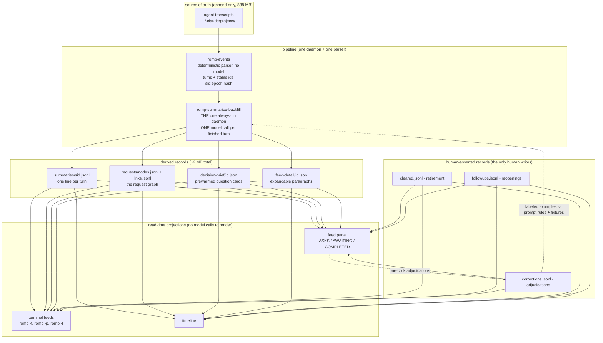
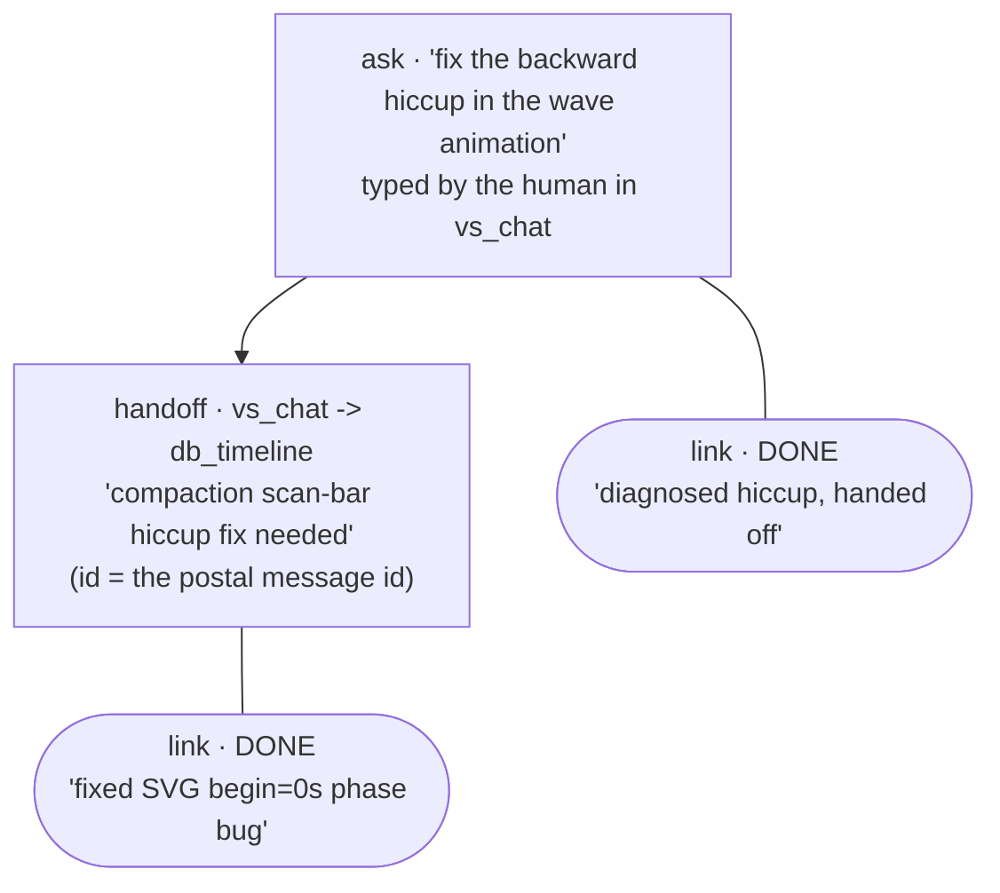
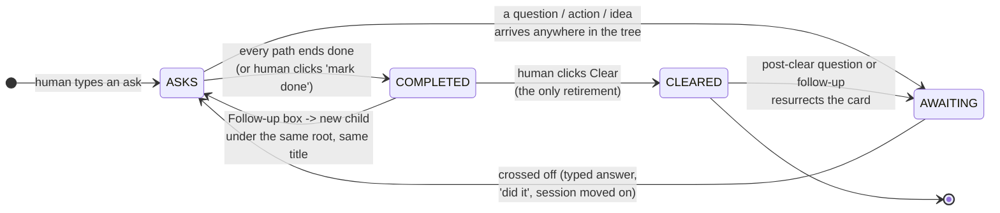
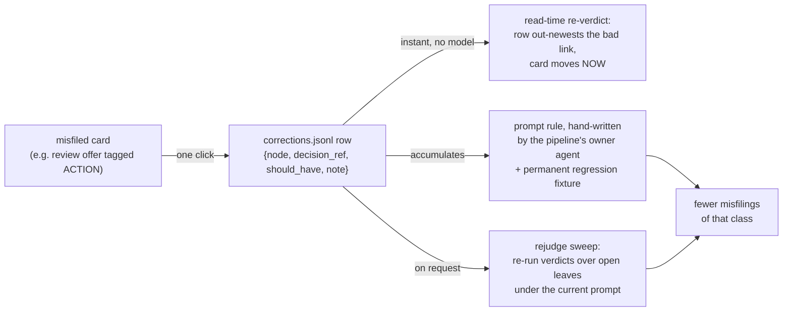
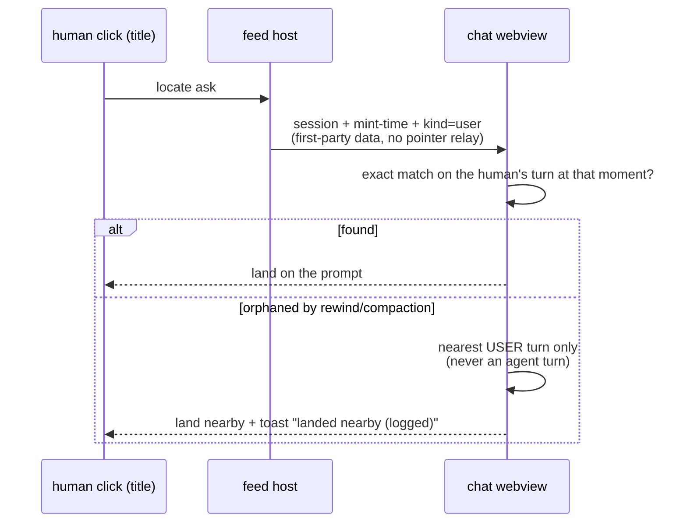

# Operating a Fleet of Coding Agents with One Human:
## an intent layer built from small model judgments and deterministic folds

*feed_design session, 2026-06-10. System of record: `~/.local/state/romp/`.
Companion documents: `romp-design.md` (design and views), `REQUESTS.md` (schema).*

---

## Abstract

A single human operating ten to thirty concurrent coding agents cannot read
what they produce: the fleet's transcripts currently total 838 MB and grow
continuously. Yet operating the fleet requires only three guarantees: a durable
memory of what the human asked for, a short live list of what needs their
input, and confidence that nothing pending was silently lost. We describe a
deployed system that provides these guarantees by distilling every agent turn
into one line of structured text produced by one constrained model call, then
deriving everything else (work attribution, completion status, attention
routing) with deterministic code over an append-only record store. The store
is roughly 400 times smaller than the transcripts it summarizes (~2 MB), and
every interface is a stateless projection of it. The model is never asked a
global question; the human is never asked to maintain state beyond one
retirement flag per request and optional one-click adjudications. Those
adjudications double as labeled training data: they instantly re-verdict the
display, batch re-judge stuck items, and accumulate into prompt rules guarded
by a regression suite (155 tests across three suites at time of writing). We
present the architecture, the key separations that make a weak judge
sufficient, representative failures from one day of live use, and the
correction loop that turned each failure into a rule.

---

## 1. The problem: attention, not information

Each agent session writes an append-only transcript of everything it does.
Nothing is missing from these files; they are also useless to a human
operator. The operating questions are not "what happened," but:

1. **What have I asked for, and what became of each ask?** (memory)
2. **What is waiting on me right now?** (attention routing)
3. **Can I trust that silence means progress, not loss?** (the inbox-zero
   guarantee)

The design target is therefore not summarization quality in the abstract. It
is the cost, in human attention, of maintaining those three guarantees. Every
component below is shaped by one asymmetry discovered early and adopted as
policy: **a wrongly-completed item is cheap (the human verifies completed work
before retiring it), but a lost ask is fatal.** The system optimizes recall on
"things that need the human" and accepts imperfect precision, then provides
one-click corrections that convert each precision failure into training data.

## 2. Architecture: one model call per turn, code for everything else



*Figure 1. The pipeline. Model calls happen in exactly one place (the daemon).
Everything to the right of it is files being joined at read time. The dashed
edges are the teaching loop (Section 6).*

Two load-bearing properties:

**Single writer per file.** The daemon writes every model-derived record. The
feed UI writes only the three human-asserted files. No locks, no merges, no
coordination protocol: append-only JSONL with one writer each.

**Read-time derivation.** Columns, tallies, owners, and status marks are
computed by joining files at render time. No view caches state; deleting every
interface loses nothing. This is what makes corrections instant: a correction
row out-newests the verdict it overrides at the next render, with no
write-side participation.

## 3. The one line the model produces

For each finished turn, the model receives the turn record plus a numbered
list of that agent's open requests, and must emit exactly one line:

```
DONE :: Shipped sort fix, debugging dup cards :: LINK 1,4 :: DONE 1
     :: DID 1=shipped the sort fix | 4=added dup-card logging
```

Five constrained judgments, all **local**:

| field | question | form |
|---|---|---|
| TAG | what does this turn need from the human? | one of 5 labels |
| phrase | what was accomplished? | ≤ 8 words |
| LINK | which open requests does it serve? | multiple choice |
| DONE | which of those did it fully discharge? | subset of LINK |
| DID | what did it do for each, separately? | ≤ 6 words each |

The TAG taxonomy routes attention, distinguished by **what crosses each off**:

- `DECISION`: the agent needs an answer to proceed. Crossed off by the
  human's next typed turn in that session, or by the session demonstrably
  moving on (it filed newer work, so the blocking question was resolved
  through some channel that types nothing: a dialog click, a picker).
- `ACTION`: the work requires a physical act to take effect (reload a window,
  run a command). Survives typing; only an explicit "did it" closes it.
- `IDEA`: an unanswered substantive alternative. The next typed turn
  dismisses it.
- `DONE`: finished; review optional. A closing review offer ("let me know if
  anything looks wrong") is DONE, not ACTION: completed work is itself the
  review trigger.
- `DETAILS`: routine progress, the default when unsure.

Live distribution over 319 link records: 167 DETAILS, 123 DONE, 21 DECISION,
6 ACTION, 2 IDEA. The skew is the point: most turns require nothing from the
human, and the system's job is to keep them off the screen.

**The key intuition: the model is never asked a hard question.** It never
matches work to the human's original intent across sessions, never decides
whether a request "as a whole" is finished, never sees an identifier. It
answers a multiple-choice question against at most a dozen candidates from its
own session's scope. Everything global is the graph's job.

## 4. The request graph: hard attribution = local match × recorded edges

Every piece of fleet work traces to an **ask** (something the human typed or
approved). When agent A mails work to agent B, that message becomes an
**internal request node** whose id is the message id and whose parent edges
name the request(s) A was serving, decided by the same local multiple-choice.
Replies attach as **links**. Agents never see or mint any id; the graph is
assembled from what they write naturally.



*Figure 2. A real two-session subgraph from 2026-06-10. Tracing the leaf back
to the human's ask follows recorded edges; no model is involved in the walk.*

Attribution to the original ask, the genuinely hard problem, decomposes into
(a) a weak model making a reliable local match inside one agent's scope, and
(b) a mechanical walk over parent edges recorded at handoff time. A wrong
local match costs display placement only, and every match is logged with its
candidate set (838 decision-log rows), so link reliability is measured, not
assumed. Current graph: 197 asks, 97 handoffs, 97 parent-edge records, 73
amendments.

## 5. Status: the leaf-path fold

The first deployed status rule (newest link anywhere decides the column)
failed in one day of real use: delegated chains never completed, because
nobody stamps "done" on every intermediate restatement. The replacement rule,
adopted as the human's own mental model, is **an ask is judged by where its
paths end**:

- each node's own status comes from the newest link directly on it;
- a node whose every downstream path ends done is done, even if nothing was
  ever filed on it directly (restatements are transparent);
- an open question anywhere bubbles to the root;
- a path that simply stops at an open leaf names the session that owes the
  human an ending (a "drop point").



*Figure 3. The lifecycle of one card. The system never retires anything:
"looks finished" is derived, "is finished" is asserted only by the human.*

The fold runs identically in two implementations (the panel's TypeScript and
the terminal's Python), kept honest by a shared test suite encoding every rule
above as a fixture (37 read-side tests).

## 6. The teaching loop: corrections as re-verdicts and as data

The human's correction affordances are deliberately one-click: **mark done**
on any open leaf, **"did it"** on an action, **"didn't need me"** on a false
AWAITING item. Each writes one row naming the node, the reply whose verdict
was wrong, and what the verdict should have been.



*Figure 4. One click, three time-scales: instant display repair, batch
re-judgment, durable rule.*

A representative case from today, end to end. An agent finished three threads
and closed with "review the delivered changes and let me know if anything
looks wrong." The classifier tagged the turn ACTION, flipping three
already-finished requests back open. The human clicked once and said "this
should be completed." The correction row closed all three instantly; the rule
now sits verbatim in the classifier prompt ("inviting a review or look is
NEVER an ACTION... a review offer is DONE"); the incident is a named fixture;
and a guardrail was added for the contradiction the card exposed (its own
explanation text said "no action is needed from you" while its tag said
ACTION; that contradiction is now logged and auto-repaired). 87 correction
rows exist; today's sweep drained 6 stuck cards and left 13 open as honest
negatives.

**On overfitting.** The 110 pipeline tests never call the model; they inject
canned model outputs and pin what the *code* does with them (parsing order,
guardrails, registry writes). Code pinned by tests cannot overfit; it is
specification. The prompt rules are the overfitting risk, and their check is
forward-looking rather than retrospective: every live judgment is logged with
its candidates, the human's daily use surfaces new misfiling shapes, and rules
are written as general classes with the incident as one example, not string
matches against past cards. The defense against overfitting is structurally
the human's continued auditing, which the system makes cheap.

## 7. Robustness rules learned in production

Three failure classes from live use produced three reusable principles.

**Degrade precision, never kind.** Deep links from cards to conversation
turns pass through several resolvers, and each used to substitute "something
nearby" when its first choice was missing (a compaction orphans a prompt line;
a rewind abandons a branch). The fix is one gate at the final hop, the only
place that can see what is actually rendered: a click that means "take me to
my prompt" may land on a *nearby* prompt, but never on agent output, and a
landing that degraded says so in a toast and logs its resolution trail
(`locate-diag.jsonl`). Upstream resolvers no longer need to be perfect.



*Figure 5. The landing contract. The worst case is reduced precision; the
kind of the destination is invariant.*

**States that change without events need one timer, not per-surface guards.**
Agent liveness is written by hooks on model events, but two state changes emit
no event at all: an idle session's dot should fade, and a session interrupted
in the terminal emits nothing that clears its "working" flag (so three
surfaces showed a 34-minute-idle session as busy). One watcher sweeps every
60 s and heals both, disambiguating "interrupted" from "long tool call" by
reading the pane itself (a working agent shows its interrupt hint; an idle one
shows the prompt box). All surfaces recover from the single repaired record.

**The chimera amend.** A follow-up message on one topic was filed as a
rewording of an ask on a different topic, producing a card whose title
corresponded to no request anyone made. Rule extracted: an amendment requires
topical continuity, not merely same-session recency; and a completed ask is
never re-titled (late amendments become children). Both are now fixtures.

## 8. What the human actually maintains

The complete list of durable human state, after one day of heavy live use:

| record | count | meaning |
|---|---|---|
| `cleared.jsonl` | 262 | "I have seen this and retire it" |
| `corrections.jsonl` | 87 | "your verdict was wrong; here is the right one" |
| `followups.jsonl` | 10 | "reopen this finished thing with new scope" |

Everything else (464 graph nodes, 319 links, 838 logged decisions, every
column placement and status mark) is derived. The interfaces stay quiet when
healthy and spend ink only on deviation; ten sessions were live while these
numbers were collected.

## 9. Limitations and open problems

- **Liveness is per-session, not per-branch.** The feed can show that a
  session holding your work is busy; it cannot prove the busyness concerns
  your ask. The unfinished-branch filter narrows but does not close this gap.
- **Question mootness is inferred, not observed.** "The session filed newer
  work, so its blocking question was resolved" is sound for blocking dialogs
  but can prematurely unflag a prose question answered to a different effect.
  The error is bounded: the node reverts to an open path (visible as a drop
  point), never disappears.
- **Prompt-rule accumulation.** Each correction class adds sentences to one
  prompt. The regression suite prevents regressions but not bloat; at some
  size, consolidation or a learned reranker over the decision log may beat
  more prose.
- **The capture boundary.** Quick directives sometimes complete as standalone
  cards rather than minting durable asks; the choice of what deserves a root
  is itself a judgment call the human occasionally corrects.

## 10. Conclusion: the intuitions

1. **Shrink the model's job until a weak judge is reliable**: one line, local
   scope, multiple choice. Recorded structure (parent edges at handoff time)
   converts local reliability into global attribution mechanically.
2. **Make every view a derivation** so that human assertions are instantly
   authoritative and nothing needs migration when rules improve.
3. **Choose your fatal error.** Here: losing an ask. Everything else
   (misattribution, false completion, wrong precision) is made cheap to see
   and one click to fix.
4. **Sell corrections back to the corrector.** The same click that fixes the
   display is a labeled example, a batch re-judgment trigger, and eventually
   a prompt rule with a permanent test. The human teaches the system as a
   side effect of using it.
